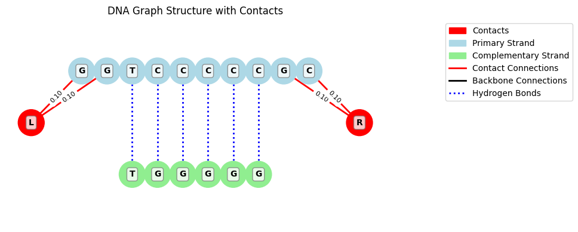

# Graph Neural Network Nucleic Acid Transport (G3NAT)

A compact Graph Neural Network project for predicting DNA transport properties (Density of States and Transmission) using PyTorch Geometric.



**Demo:** [](https://colab.research.google.com/drive/13gInyEBZVMuL1ma-jB5U1pHU917bT9U8?usp=sharing)

Full DNA DFT dataset status: _In Progress_

### Core modules
- `models.py`: GNN models (standard and Hamiltonian), NEGF projection, training utilities, loading and inference helpers
- `dataset.py`: DNA sequence to graph conversion and dataset creation utilities
- `data_generator.py`: Synthetic data generation via a simple tight-binding DNA model + NEGF
- `main.py`: End-to-end training pipeline and sample prediction/plotting
- `visualize_dna_graph.py`: NetworkX-based visualization of DNA graphs

### Install
```bash
pip install -r requirements.txt
```

### Quick start
To use synthetic data from an approximate tight-binding hamiltonian, use the `train_from_TB.py` method:
```bash
python train_from_TB.py \
  --num_samples 2000 \
  --seq_length 8 \
  --num_energy_points 100 \
  --model_type standard \
  --batch_size 32 \
  --num_epochs 100 \
  --learning_rate 1e-3
```
Outputs (model checkpoint, curves, sample prediction plots) are saved under `./outputs` and `./checkpoints`.

To resume training, pass `--resume_from path/to/checkpoint_latest.pth`.


### Inference with a trained model
You can create and load trained models to use for transport prediction, and the access the tight binding hamiltonian direcly from the model:
```python
from models import load_trained_model, predict_sequence

model, energy_grid, device = load_trained_model('outputs/dna_transport_standard_model.pth')
dos_pred, trans_pred = predict_sequence(
    model,
    sequence="ACGTACGT",
    complementary_sequence="TGCATGCA",  # or omit to treat as single strand with blanks
    left_contact_positions=0,
    right_contact_positions=7,
    left_contact_coupling=0.1,
    right_contact_coupling=0.2,
)
H_TB = model.H[0].detach().cpu().numpy()  # Converts PyTorch tensor to NumPy array
```

### Visualize graphs
```python
from dataset import sequence_to_graph
from visualize_dna_graph import visualize_dna_graph

G = sequence_to_graph("ACGTACGT", "TGCATGCA", left_contact_positions=0, right_contact_positions=7)
fig, ax = visualize_dna_graph(G, "ACGTACGT", "TGCATGCA")
```


### Training from dataset (pickle format)

For this work, we have generated a dataset of 500 structures with 4 contact positions for a total of 2000 data points **(NOTE: in progress, link to be uploaded when complete)*

To use this data set, ensure that all pickle files are in the correct directory, and use the `train_from_pickles.py` script. This can be used specifying traing parameters like so:

```bash
python train_from_pickles.py \
    --data_dir /path/to/pickle/files \
    --train_ratio 0.70 \
    --val_ratio 0.15 \
    --test_ratio 0.15 \
    --hidden_dim 128 \
    --num_layers 4 \
    --num_heads 4 \
    --n_orb 1 \
    --batch_size 32 \
    --num_epochs 100 \
    --learning_rate 1e-3 \
    --output_dir ./my_results \
    --checkpoint_dir ./my_checkpoints \
    --model_name my_dna_model
```


### Notes
- Node features: 4 one-hot features (A, T, G, C)
- Edge features: 5 values per edge: [backbone_onehot, hbond_onehot, contact_onehot, directionality, coupling]
- Hamiltonian NEGF implementation is vectorized for stability; transmission/DOS are returned as log10-safe values for training stability in `DNATransportHamiltonianGNN`.

### Contact configuration defaults
- **Default policy (graph + generator)**: left contact attaches to position `0` of the primary strand; right contact attaches to position `len(primary_sequence) - 1` of the primary strand.
- **Specifying contacts**: pass `int`, `List[int]`, or `Tuple[str, Union[int, List[int]]]` where the first element of the tuple is `'primary'` or `'complementary'` to target a specific strand.
  - Example:
    ```python
    from dataset import sequence_to_graph

    G = sequence_to_graph(
        primary_sequence="ACGTACGT",
        complementary_sequence="TGCATGCA",
        left_contact_positions=("primary", 0),
        right_contact_positions=("primary", 7),
        left_contact_coupling=0.1,
        right_contact_coupling=0.2,
    )
    ```
- **Complementary indexing**: positions for the complementary strand are 0-indexed into the provided `complementary_sequence` string.
- **Consistency**: the simple physics generator in `data_generator.create_hamiltonian` follows the same default (primary-end) policy. Dataset helpers will not override explicitly provided contact positions.

### Hamiltonian construction semantics
- In `DNATransportHamiltonianGNN`, the Hamiltonian is constructed directly from the graph:
  - **Nodes** contribute onsite blocks (diagonal terms).
  - **Edges** contribute coupling blocks (off-diagonal terms).
