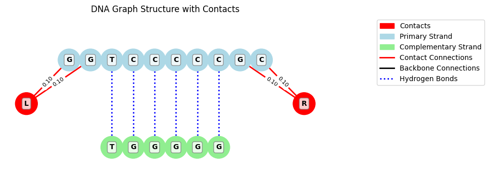

# Graph Neural Network Nucleic Acid Transport (G3NAT)

A compact Graph Neural Network project for predicting DNA transport properties (Density of States and Transmission) using PyTorch Geometric.



**Demo:** [](https://colab.research.google.com/drive/13gInyEBZVMuL1ma-jB5U1pHU917bT9U8?usp=sharing)

Full DNA DFT dataset status: _In Progress_

### Core modules
- `g3nat/models/`: GNN models (standard and Hamiltonian), NEGF projection
- `g3nat/graph/`: DNA sequence to graph conversion (core innovation); optional X3DNA/DSSR edge-geometry extraction (`geometry.py`)
- `g3nat/data/`: Dataset creation, synthetic data generation, pickle loading
- `g3nat/training/`: Training loop, configuration, callbacks
- `g3nat/utils/`: Device setup, physics utilities (Hamiltonian, NEGF)
- `g3nat/visualization/`: NetworkX-based visualization of DNA graphs
- `g3nat/evaluation/`: Model loading and inference helpers
- `scripts/train.py`: Unified training script for both synthetic and pickle data

### Install
```bash
pip install -r requirements.txt
```

### Quick start
To use synthetic data from an approximate tight-binding hamiltonian:
```bash
python scripts/train.py \
  --data_source tb \
  --num_samples 2000 \
  --seq_length 8 \
  --num_energy_points 100 \
  --model_type hamiltonian \
  --batch_size 32 \
  --num_epochs 100 \
  --learning_rate 1e-3
```
Outputs (the final model, and `checkpoint_latest.pth` / `checkpoint_best.pth`) are saved under
`./outputs` and `./checkpoints`. Training itself writes no figures -- plots come from the
separate scripts `scripts/dos_map.py`, `scripts/plot_ldos_tradeoff.py` and
`scripts/fray_plots.py`.

To resume training, pass `--resume_from path/to/checkpoint_latest.pth`.


### Inference with a trained model
You can create and load trained models to use for transport prediction, and the access the tight binding hamiltonian direcly from the model:
```python
from g3nat.evaluation import load_trained_model, predict_sequence

model, energy_grid, device = load_trained_model('outputs/hamiltonian_pickle_model.pth')
dos_pred, trans_pred = predict_sequence(
    model,
    sequence="ACGTACGT",
    complementary_sequence="__GTAC__",      # or omit to use complementary strand
    left_contact_positions=0,               # Defaults to index on primary strand
    right_contact_positions=7,
    left_contact_coupling=0.1,
    right_contact_coupling=0.1,
)
H_TB = model.H[0].detach().cpu().numpy()  # Converts PyTorch tensor to NumPy array
```

### Visualize graphs
```python
from g3nat.graph import sequence_to_graph
from g3nat.visualization import visualize_dna_graph

G = sequence_to_graph("ACGTACGT", "TGCATGCA", left_contact_positions=0, right_contact_positions=7)
fig, ax = visualize_dna_graph(G, "ACGTACGT", "TGCATGCA")
```


### Training from dataset (pickle format)

For this work, we have generated a dataset of ~515 sequences, each with 4 contact/coupling variants (2 contact types x 2 couplings), for a total of ~2058 data points **(NOTE: in progress, link to be uploaded when complete)**

To use this data set, ensure that all pickle files are in the correct directory, and use the unified training script:

```bash
python scripts/train.py \
    --data_source pickle \
    --data_dir /path/to/pickle/files \
    --model_type hamiltonian \
    --hidden_dim 128 \
    --num_layers 4 \
    --num_heads 4 \
    --n_orb 1 \
    --batch_size 32 \
    --num_epochs 100 \
    --learning_rate 1e-3 \
    --output_dir ./my_results \
    --checkpoint_dir ./my_checkpoints
```


### Edge geometry (X3DNA / DSSR) -- optional, experimental

`DNATransportHamiltonianGNN` can consume an SE(3)-invariant description of the local
geometry on each edge (X3DNA base-pair-step and base-pair parameters plus a base-centroid
distance), gated by `--use_geometry`. It is off by default; when off, the model is
byte-for-byte identical to the standard one and existing checkpoints load unchanged.

Build the per-sequence geometry cache once (offline; requires the X3DNA-DSSR binary and PDB
structures that have residue names -- the pickle `gjf_text` is coordinates only and cannot
be used):

```python
from g3nat.graph.geometry import build_geometry_cache
build_geometry_cache('/path/to/pdb/dataset', 'geom_cache/geometry.pkl')
```

Then train with geometry on:

```bash
python scripts/train.py --data_source pickle --data_dir /path/to/pickle/files \
    --model_type hamiltonian --conv_type gat --use_geometry \
    --geom_cache geom_cache/geometry.pkl
```

**Honest caveat:** on the current DFT dataset the structures are idealized fiber B-DNA, so
the geometry is near-constant across sequences and carries no predictive signal. The
strongest evidence is structural rather than a loss comparison: the phosphorus coordinates
are **bit-identical** across different sequences of the same length, so only base atoms
differ and any geometric descriptor is near-constant by construction. (An early geometry-on
vs geometry-off comparison, 0.538 vs 0.547, agreed -- but both numbers are final-epoch under
the since-retired leaking split, so treat them as illustrative, not as the evidence. See
`docs/model-results.md`.) The feature is infrastructure for future datasets with real
geometric variation (MD / crystal / predicted structures).

### Notes
- Node features: 4 one-hot features (A, T, G, C)
- Edge features (`edge_attr`): 5 values per edge: [backbone_onehot, hbond_onehot, contact_onehot, directionality, coupling]
- Optional edge geometry: with `--use_geometry`, each edge additionally carries a separate SE(3)-invariant `edge_geom` (7 values) channel plus an `edge_geom_mask`; `edge_attr` itself is unchanged. See "Edge geometry" above.
- Default graph convolution for the Hamiltonian model is `gat`, for continuity with existing runs rather than because it is measurably better: on best-val under a sequence-grouped split the two **tie** (gat 0.592 +/- 0.010 over 3 seeds, transformer 0.579 over 1). The earlier claim that gat won decisively compared final-epoch values under a split that leaked sequences across train and val, and is retracted. `--conv_type transformer` does fit the synthetic TB data better. See `docs/model-results.md`.
- Hamiltonian NEGF implementation is vectorized for stability; transmission/DOS are returned as log10-safe values for training stability in `DNATransportHamiltonianGNN`.

### Contact configuration defaults
- **Default policy (graph + generator)**: left contact attaches to position `0` of the primary strand; right contact attaches to position `len(primary_sequence) - 1` of the primary strand.
- **Specifying contacts**: pass `int`, `List[int]`, or `Tuple[str, Union[int, List[int]]]` where the first element of the tuple is `'primary'` or `'complementary'` to target a specific strand.
  - Example:
    ```python
    from g3nat.graph import sequence_to_graph

    G = sequence_to_graph(
        primary_sequence="ACGTACGT",
        complementary_sequence="TGCATGCA",
        left_contact_positions=("primary", 0),
        right_contact_positions=("primary", 7),
        left_contact_coupling=0.1,
        right_contact_coupling=0.2,
    )
    ```
- **Complementary indexing**: positions for the complementary strand are 0-indexed into the provided `complementary_sequence` string.
- **Consistency**: the simple physics generator in `g3nat.utils.create_hamiltonian` follows the same default (primary-end) policy. Dataset helpers will not override explicitly provided contact positions.

### Hamiltonian construction semantics
- In `DNATransportHamiltonianGNN`, the Hamiltonian is constructed directly from the graph:
  - **Nodes** contribute onsite blocks (diagonal terms).
  - **Edges** contribute coupling blocks (off-diagonal terms).
