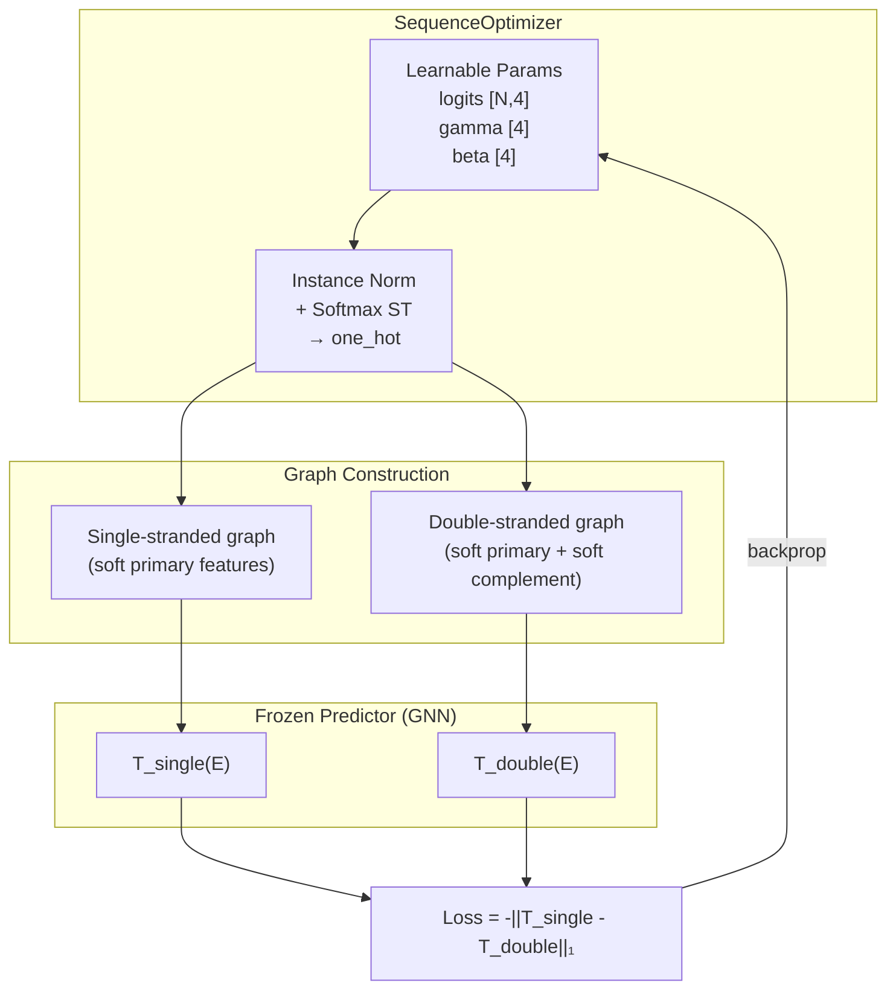
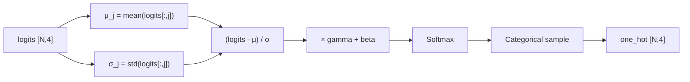
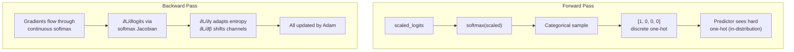
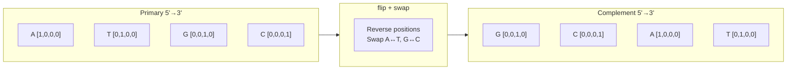
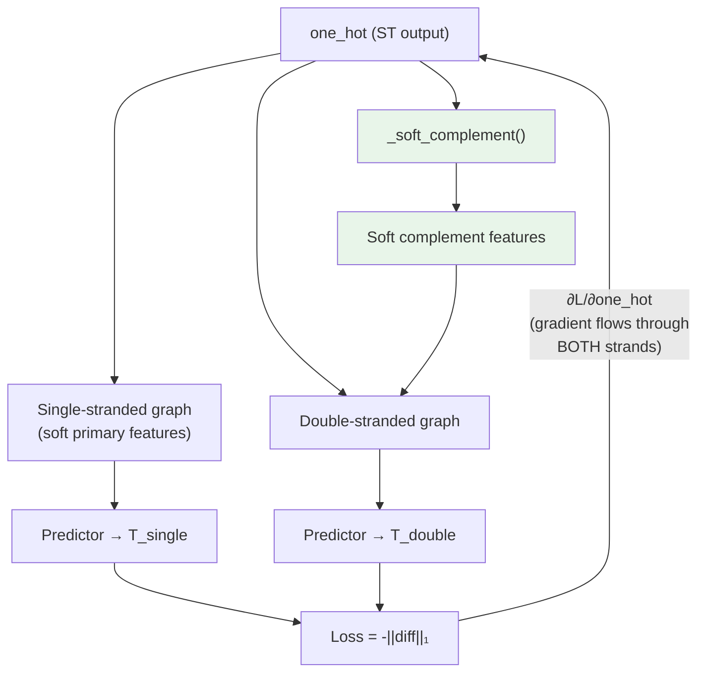
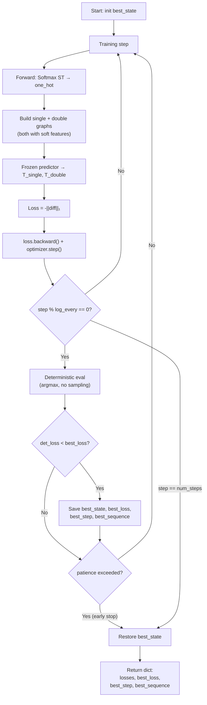
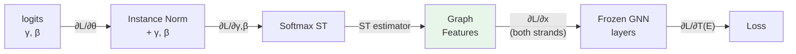
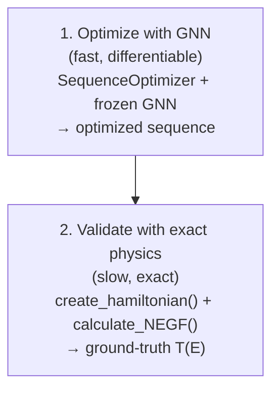

# Generator Module — Architecture & How It Works

## Overview

The generator module (`g3nat/models/generator.py`) contains **`SequenceOptimizer`** — learns DNA sequences that maximize the change in electrical transmission upon hybridization (complementary strand binding). Uses a differentiable GNN predictor with Softmax Straight-Through gradient flow and adaptive entropy. Based on Fast SeqProp (Linder & Seelig, 2021).

For ground-truth physics evaluation, use `create_hamiltonian()` and `calculate_NEGF()` from `g3nat.utils.physics` directly.

**Goal**: Find sequence S such that `||T_single(S) - T_double(S)||₁` is maximized.

### References

- Linder, J., & Seelig, G. (2021). Fast activation maximization for molecular sequence design. *BMC Bioinformatics*, 22, 510. https://doi.org/10.1186/s12859-021-04437-5
- Reference implementation: https://github.com/johli/seqprop

---

## SequenceOptimizer

### How It Works

The optimizer maintains **learnable parameters** optimized jointly via Adam against a frozen GNN predictor:

- **Logits** `[N, 4]` — per-position nucleotide preferences
- **Gamma** `[4]` — per-channel scale (controls sampling entropy adaptively) *(when instance norm is enabled)*
- **Beta** `[4]` — per-channel offset *(when instance norm is enabled)*



### Instance Normalization + Softmax ST

**Default: off.** Logits feed directly to Softmax. This matches the paper's default (`batch_normalize_pwm=False`) and works for any sequence length including homopolymers.

When `use_instance_norm=True`, per-channel instance normalization with learnable gamma/beta is applied before Softmax. Gamma adaptively controls sampling entropy — replacing manual temperature schedules. **Caution: mathematically cannot represent homopolymers** (poly-C, poly-T, etc.) because a uniform column has zero variance and normalizes to zero.



### Softmax Straight-Through Estimator

The forward pass samples **discrete one-hot** vectors from the categorical distribution (keeping the predictor in-distribution). The backward pass substitutes the **softmax gradient** for the non-differentiable sampling step.



### Adaptive Entropy (gamma)

Instead of a fixed temperature schedule, the learnable scale parameter gamma controls sampling entropy per channel. Adam optimizes gamma alongside logits:

- **gamma large** → scaled logits spread out → sharper softmax → lower entropy (exploitation)
- **gamma small** → scaled logits compressed → flatter softmax → higher entropy (exploration)

### Soft Complement (Differentiable Gradient Flow)

**Problem**: The original implementation decoded the one-hot to a string, computed the reverse complement string, and built the complement graph from hard one-hot features. This breaks gradient flow through the double-stranded path — the optimizer has no signal about how changing the primary sequence changes the complement.

**Solution**: `_soft_complement()` computes the Watson-Crick reverse complement directly on soft one-hot tensors:

```python
soft_bases.flip(0)[:, [1, 0, 3, 2]]
```

This does two operations:
1. `flip(0)` — reverse positions (antiparallel strand orientation)
2. `[:, [1, 0, 3, 2]]` — swap A↔T (columns 0↔1) and G↔C (columns 2↔3)



Both strands now carry gradients, enabling correct optimization of the double-stranded path.



### Training vs Eval Mode

| | Training Mode | Eval Mode |
|---|---|---|
| **Sampling** | Categorical sample (stochastic) | Argmax (deterministic) |
| **Gradient** | Straight-through estimator | No gradient needed |
| **Use** | During `optimize()` loop | For evaluation/best-seen tracking |

### Optimization Loop with Best-Seen Tracking



### Gradient Flow Path



Key: gradients flow through **both** the single-stranded and double-stranded paths because `_soft_complement()` is differentiable.

### Loss Function

The loss uses **L1 norm** (sum of absolute differences) rather than L2, because L1 avoids over-weighting isolated resonance peaks in the transmission spectrum.

```
Loss = -||T_single(E) - T_double(E)||₁

With energy mask (optional):
Loss = -||(T_single(E) - T_double(E)) × mask(E)||₁
```

---

## Typical Workflow



### Example: Optimize and Validate

```python
import numpy as np
import torch
from g3nat.models.generator import SequenceOptimizer
from g3nat.utils.physics import create_hamiltonian, calculate_NEGF
from g3nat.evaluation import load_trained_model

# Step 1: Optimize with GNN
opt = SequenceOptimizer(seq_length=4)
predictor, energy_grid, device = load_trained_model("trained_models/model.pth")

result = opt.optimize(predictor, num_steps=500, lr=0.001, log_every=100)

print(f"Best loss: {result['best_loss']:.4f} at step {result['best_step']}")
print(f"Best sequence: 5'-{result['best_sequence']}-3'")

# Get optimized sequence (best-seen params are already restored)
opt.eval()
with torch.no_grad():
    one_hot, _ = opt()
sequence = opt.decode_sequence(one_hot)
complement = opt.get_complement(sequence)

# Step 2: Validate against exact physics
energy_grid = np.linspace(-3, 3, 100)

H_s, GL_s, GR_s = create_hamiltonian(sequence, '_' * len(sequence))
trans_single, dos_single = calculate_NEGF(H_s, GL_s, GR_s, energy_grid)

H_d, GL_d, GR_d = create_hamiltonian(sequence, complement)
trans_double, dos_double = calculate_NEGF(H_d, GL_d, GR_d, energy_grid)

score = np.sum(np.abs(np.log10(trans_single + 1e-30) - np.log10(trans_double + 1e-30)))
print(f"Ground-truth score: {score:.4f}")
```

### With Early Stopping

```python
result = opt.optimize(
    predictor,
    num_steps=2000,
    lr=0.001,
    log_every=50,
    patience=5,       # stop after 5 eval rounds without improvement
)
print(f"Stopped at step {len(result['losses'])} / 2000")
```

### Using an Energy Mask

```python
# Only optimize transmission difference in the [-1, 0] eV window
energy_grid = torch.linspace(-3, 3, 100)
mask = ((energy_grid >= -1) & (energy_grid <= 0)).float()

result = opt.optimize(predictor, num_steps=500, energy_mask=mask, log_every=100)
```

### Seeding from a Known Sequence

```python
# Start optimization from a known good sequence instead of random logits
opt = SequenceOptimizer(seq_length=8, init_sequence='GAAAGCGA')
result = opt.optimize(predictor, num_steps=500, lr=0.01, log_every=100)
# Optimizer explores the neighborhood of GAAAGCGA
```

**Note:** `init_sequence` seeds the logits strongly toward the given sequence and the optimizer will hold it if it's already good. However, **gradient-based optimization cannot reliably navigate from one sequence to a nearby better one** when the GNN's local gradient disagrees with the global optimum — the GNN was trained on diverse sequences and its gradient landscape near homopolymers may be unreliable. If you know the target sequence, seed directly from it rather than from a "close" sequence. For exact initial fidelity with `use_instance_norm=True`, pass both:

```python
opt = SequenceOptimizer(seq_length=8, init_sequence='GAAAGCGA', use_instance_norm=False)
```

### Without Instance Normalization (Default)

```python
# Default behaviour — no instance norm, works for all sequence lengths
opt = SequenceOptimizer(seq_length=8)
result = opt.optimize(predictor, num_steps=500, lr=0.01, log_every=100)
```

---

## Debugging & Convergence

### Expected Behavior

- **Per-step training loss**: Noisy (due to stochastic sampling). Not monotonically decreasing.
- **Deterministic loss** (logged every `log_every` steps): Should generally improve. This is what best-seen tracking uses.
- **Gamma adaptation**: Gamma values typically grow over training as the optimizer becomes more confident (exploitation). If gamma shrinks, the optimizer is exploring.

### Signs of Problems

| Symptom | Likely Cause | Fix |
|---------|-------------|-----|
| Loss stays flat | Learning rate too low | Increase `lr` |
| Loss explodes | Learning rate too high | Decrease `lr` |
| Sequence never changes | Gamma too large (frozen) | Restart with fresh init |
| Very noisy, no trend | Instance norm unstable | Disable `use_instance_norm` (it's off by default) |
| init_sequence ignored, drifts elsewhere | GNN gradient disagrees locally | Seed directly from the target, not from a nearby sequence |

### Choosing Hyperparameters

| Parameter | Guidance |
|-----------|----------|
| `lr` | Default 0.001 (paper's Adam config). Increase to 0.01 for faster convergence on short sequences. |
| `patience` | 5 is a good default (matches paper). Use `None` for fixed-budget runs. |
| `log_every` | 50-100 for normal runs. Smaller values = more frequent eval = slower training. |
| `use_instance_norm` | `False` (default, matches paper). Instance norm can't represent homopolymers (poly-C, poly-T). Enable for long diverse sequences (50bp+) where it stabilizes training. |
| `num_steps` | 500-2000 depending on sequence length. Longer sequences need more steps. |
| `init_sequence` | Seed from a known good sequence to explore its neighborhood. Use with `use_instance_norm=False` for exact init fidelity. |

---

## API Reference

### SequenceOptimizer

| Constructor Parameter | Type | Default | Description |
|---|---|---|---|
| `seq_length` | int | required | Number of DNA bases to optimize |
| `use_instance_norm` | bool | `False` | Enable instance normalization with gamma/beta. Caution: cannot represent homopolymers. |
| `init_sequence` | str | `None` | DNA string to seed logits from (must match `seq_length`) |

| Learnable Parameter | Shape | Init | Description | Condition |
|---|---|---|---|---|
| `logits` | `[N, 4]` | `randn` (or biased toward `init_sequence`) | Per-position nucleotide logits | Always |
| `gamma` | `[4]` | `ones` | Per-channel scale (adaptive entropy) | `use_instance_norm=True` |
| `beta` | `[4]` | `zeros` | Per-channel offset | `use_instance_norm=True` |

| Method | Signature | Returns |
|---|---|---|
| `forward` | `()` | `(one_hot [N,4], scaled_logits [N,4])` |
| `decode_sequence` | `(one_hot)` | DNA sequence string |
| `get_complement` | `(sequence: str)` | Watson-Crick reverse complement string |
| `_soft_complement` | `(soft_bases)` | Differentiable reverse complement tensor `[N,4]` |
| `_build_double_soft` | `(soft_bases)` | `Data` graph with soft features on both strands |
| `build_graph_with_soft_features` | `(soft_bases, complementary_sequence=None)` | `Data` graph |
| `compute_loss` | `(trans_single, trans_double, energy_mask=None)` | scalar loss tensor (negative L1 norm) |
| `_eval_deterministic` | `(predictor, energy_mask=None)` | `(loss_value, sequence_string)` |
| `optimize` | `(predictor, num_steps, lr=0.001, energy_mask=None, log_every=100, patience=None)` | `dict` (see below) |

### `optimize()` Return Value

```python
{
    'losses': [float, ...],      # Per-step training losses
    'best_loss': float,          # Best deterministic loss seen
    'best_step': int,            # Step at which best loss occurred
    'best_sequence': str,        # DNA string at best step
}
```

---

## File Structure

```
g3nat/
  models/
    generator.py          <- SequenceOptimizer
    standard.py           <- DNATransportGNN (predictor option 1)
    hamiltonian.py        <- DNATransportHamiltonianGNN (predictor option 2)
    __init__.py           <- exports all model classes
  graph/
    construction.py       <- sequence_to_graph() used for topology
  utils/
    physics.py            <- create_hamiltonian(), calculate_NEGF() (ground-truth physics)
  __init__.py             <- top-level exports

tests/
  test_models/
    test_generator.py     <- tests for SequenceOptimizer
```
