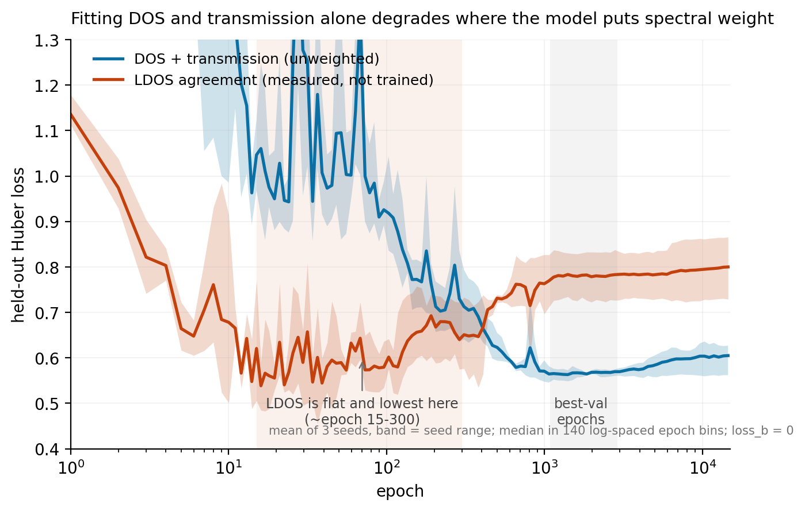
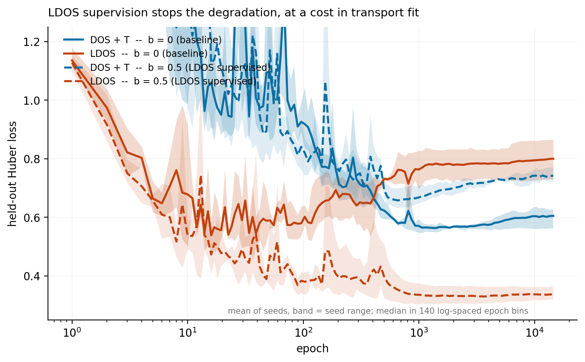

# Model Results (measured)

Running log of measured training results, so model-selection decisions are backed by
recorded numbers rather than memory. Val loss = final validation loss reported by the
training loop (log10 DOS + log10 transmission MSE, see `g3nat/models/hamiltonian.py`).

## Graph convolution type: GAT vs Transformer

> **WARNING (2026-07-24): this comparison does not survive scrutiny -- see section 4f at the
> bottom.** These are final-epoch numbers under the leaking split, and the transformer is now
> known to overfit badly (best val 0.579 reached 3650 epochs before its final 0.650). A
> final-epoch comparison of overfitting runs measures degradation past the optimum, not fit.
> Under the clean split with best-val, GAT (0.592 +/- 0.010) and transformer (0.579) look like
> a tie. The `gat` default is not currently evidence-backed; re-run with early stopping.

**Decision: `--conv_type` default is `gat`** (set in `scripts/train.py`). GAT is the best
DFT-fitting convolution on record. The winner is dataset-dependent (see table), and the
current and upcoming work (X3DNA edge geometry, Plan 2) is on the DFT/pickle data, where
GAT wins decisively.

| Dataset            | conv        | final val loss | model file                                        | training log        |
|--------------------|-------------|----------------|---------------------------------------------------|---------------------|
| DFT (pickle)       | **gat**     | **0.5469**     | `outputs_pickle_gat/hamiltonian_pickle_model.pth` | `slurm-37393473.out`|
| DFT (pickle)       | transformer | 1.4197         | `outputs_pickle/hamiltonian_pickle_model.pth`     | `slurm-37391502.out`|
| TB synthetic (regen)| transformer | 0.0381         | `outputs_regen_transformer/hamiltonian_tb_model.pth`| `slurm-37375162.out`|
| TB synthetic (regen)| gat        | 0.4775         | `outputs_regen_gat/hamiltonian_tb_model.pth`      | `slurm-37373544.out`|

Reading: on DFT data GAT is ~2.6x lower val loss than Transformer (0.547 vs 1.42). On the
synthetic tight-binding data the ordering flips (Transformer 0.038 vs GAT 0.477). The
default is chosen for the DFT line of work.

All four runs are base-aware (Hamiltonian coupling depends on the two endpoint bases;
`g3nat/models/hamiltonian.py:164`, introduced in commit 69ef4d6). "base-aware" is intrinsic
to the current model, not a toggle.

## Best DFT model of record

- **File:** `outputs_pickle_gat/hamiltonian_pickle_model.pth`
  (also copied to `trained_models/hamiltonian_DFT_gat_baseaware.pth` as the canonical artifact)
- **Val loss:** 0.5469 (~0.547)
- **Config:** GAT + base-aware; hidden_dim=256, num_layers=4, num_heads=4, n_orb=1,
  lr=1e-3, batch=64, epochs=5000, data_source=pickle (DFT).
- **Provenance:** trained in `slurm-37393473.out`; config echoed in `slurm-37393449.out`
  (`conv=GAT ... params=665,346`).

Note: `--hidden_dim 256` was passed on the command line for these runs; the `train.py`
default remains 128.

## X3DNA edge geometry (Plan 2)

The geometry model-integration work defaults to `conv_type='gat'` (this result). See
`docs/superpowers/specs/2026-07-20-x3dna-edge-geometry-design.md`.

### Plumbing-check run: geometry ON vs OFF (DFT, GAT, 5000 epochs)

| run                 | final val | model file                                          | training log        |
|---------------------|-----------|-----------------------------------------------------|---------------------|
| geometry OFF (base) | 0.5469    | `outputs_pickle_gat/hamiltonian_pickle_model.pth`   | `slurm-37393473.out`|
| geometry ON         | 0.5383    | `outputs_pickle_gat_geom/hamiltonian_pickle_model.pth` | `slurm-37408577.out`|

Same config (GAT + base-aware, hidden=256, batch=64, 5000 epochs, DFT pickle), the
only difference is `--use_geometry`. **Interpretation: indistinguishable, NOT an
improvement.** The 0.009 gap is smaller than each run's own late-epoch wobble
(geom-ON 0.538-0.556, baseline 0.527-0.547 over their last 50 epochs), and the
geometry on this dataset is near-constant (idealized fiber B-DNA: rise 3.375 +/- 0.005,
twist 35.9 +/- 1.0, h-bond stagger exactly 0), so it carries no predictive signal.
What this run confirms is the plumbing: `--use_geometry` runs end-to-end on the full
dataset, trains stably (no NaN despite the near-constant features + 1e-6 std floor),
and the added geom_encoder neither helps nor hurts. Real "geometry helps" needs varied
structures (MD / crystal / predicted), which this branch is built to receive.

## Onsite/spectrum window constraint -- NEGATIVE RESULT (2026-07-23)

> **Read the corrections further down this file before taking this section at face value.**
> Two of its premises have since been retracted: (1) the [-1,1] window is the SUPERVISION
> range (HOMO +/- 1 eV per sequence), not a physicality criterion, so "UNPHYSICAL" verdicts
> based on window membership overstate what was measured; (2) "matches Roche" for the
> synthetic control is legitimate, but for DFT models G sits near 0 by the energy convention
> rather than by fit. The -33 eV runaway IS still pathological and that finding stands. See
> "The [-1,1] window is the supervision range" below, and `docs/dataset.md`.

Goal: force the learned reduced Hamiltonian to be physical (energies inside the transmission
window). Branch `constrain-onsite-window` (DEAD, not merged).

**Physicality of existing models** (onsite = diag(H); eig = eigvalsh(H); window [-1,1] eV):

| model | val loss | onsite [min,max] | eig [min,max] | eig in-window | verdict |
|-------|----------|------------------|---------------|---------------|---------|
| GAT-DFT (baseline) | 0.547 | [-32.5, -0.30] | [-33.4, -0.01] | 59% | UNPHYSICAL |
| transformer-DFT | 1.42 | [-0.71, 2507] | [-0.81, 2651] | 25% | worse |
| GAT-TB (synthetic) | 0.477 | [-1.41, 0.02] | [-1.59, 0.03] | 100% | physical (matches Roche) |
| transformer-TB (synthetic) | 0.038 | [-1.40, 0.01] | [-1.62, 0.10] | 100% | physical |

Key finding: **physicality tracks the DATA, not the architecture.** When the ground truth is a
physical per-base TB (synthetic), both convs recover it. On real DFT both distort; the low-loss
GAT "win" (0.547) is an unphysical H. Likely a 1-orbital-per-base TB cannot represent full DFT
transport.

**Soft penalty attempts** (GAT + base-aware, hidden=256, 5000 epochs, W=10):

| constraint | final val | onsite result | eig in-window |
|------------|-----------|---------------|---------------|
| diagonal penalty | 1.87 | collapsed to -0.97 | (n/a) |
| eigenvalue penalty | 2.19 | collapsed to -0.63 | 100% |

Both failed: a penalty enforces a RANGE but not STRUCTURE, so the optimizer collapses every
onsite to one value (in-window, degenerate, useless). Penalty route exhausted.

**Next (planned, fresh branch off main):** structured onsite head -- tie onsite to base identity
(residual base-baseline + limited context correction) so physicality comes from the
parameterization, not a penalty. See the `g3nat` skill "Active investigation" for the reasoning.

## Clean (grouped) split: the honest baseline (2026-07-24)

Every DFT val number above this line was computed under a LEAKING flat-index split
(`train_test_split(range(len(dataset)))` over ~2057 samples that are 515 sequences x 4
contact variants, so the same sequence appears in train and val). Fixed in commit c7feebd
(`GroupShuffleSplit` on the sequence string).

The leaking run scores 0.547; the grouped-split run scores **0.6054**
(`outputs_onsite_sweep_a0_s42`, which is alpha=0 == the unmodified model). Treat 0.605, not
0.547, as the free-model reference. Numbers above the line are not re-run, remain optimistic,
and should not be compared across the line.

**Do not attribute the whole 0.058 gap to the leak.** The two runs differ in more than the
split: the 0.547 record used `batch=64`, while the sweep runner
(`scripts/run_onsite_sweep.sh:69`) uses `--batch_size 32`. The gap therefore confounds split
with batch size, and it is a single seed on each side. The direction (clean split is worse)
is what the leak predicts and is not in doubt; the magnitude is not established. A clean
attribution needs the leaking config re-run at batch=32, or the grouped split at batch=64.

## Structured onsite head: alpha sweep (2026-07-24)

Config: GAT + base-aware, hidden=256, num_layers=4, num_heads=4, n_orb=1, lr=1e-3,
5000 epochs, DFT pickle, **grouped split**, `--split_seed 42`. Runner:
`scripts/run_onsite_sweep.sh`. Collector: `scripts/collect_onsite_sweep.py`.
Raw output: `slurm-37620671.out`. Physicality measured over a fixed sample of 400 unique
DFT sequences (identical across cells). Window = [-1, 1] eV.

| alpha | val_loss | tail_mean | slope/ep  | ons_in_win | eig_in_win | coup_bw | eta2  | distinct |
|-------|----------|-----------|-----------|------------|------------|---------|-------|----------|
| 0     | 0.6054   | 0.6033    | -7.32e-05 | 0.381      | 0.396      | 0.94    | 0.028 | 0.000    |
| 0.25  | 0.6312   | 0.6207    | -2.86e-04 | 0.457      | 0.443      | 1.67    | 0.001 | 0.011    |
| 0.5   | 0.5734   | 0.5756    | -1.76e-05 | 0.416      | 0.430      | 0.83    | 0.001 | 0.020    |
| 0.75  | 0.5881   | 0.5842    | -1.63e-04 | 0.445      | 0.450      | 2.93    | 0.003 | 0.006    |
| 0.9   | 0.6928   | 0.7042    | -2.17e-04 | 0.576      | 0.573      | 0.28    | 0.745 | 0.494    |
| 1.0   | 0.7034   | 0.6592    | +1.73e-04 | 0.244      | 0.484      | 0.62    | 1.000 | 0.061    |

All six cells satisfy |slope| <= 3e-4/epoch, so none is under-converged by that criterion --
alpha=1.0's +1.73e-4 is in fact *smaller* in magnitude than alpha=0.25's -2.86e-4. What
actually singles alpha=1.0 out: it is the only cell with a **positive** tail slope, and the
only one whose final epoch exceeds its own tail mean by more than 5% (+6.70%, versus +1.70%
for the next-worst and <1% for the rest). Read its headline number as ~0.66-0.70, not 0.7034.

**Learned per-base baselines** (eV, `onsite_baseline`, n_orb=1):

| alpha | A       | T       | G       | C       | range (max-min) | min pairwise gap |
|-------|---------|---------|---------|---------|-----------------|------------------|
| 0.9   | -1.1252 | -0.6315 | +0.2508 | -1.6306 | 1.882           | 0.494 (A-T)      |
| 1.0   | -1.2725 | -1.1955 | -0.2950 | -1.3340 | 1.039           | 0.061 (C-A)      |

Note the column is max-min. Do NOT confuse it with `baseline_distinctness()['spread']` in
`g3nat/evaluation/physicality.py`, which returns the population *std* of the same four
values (0.694 and 0.424 respectively).

### CORRECTION: the alpha sweep does not measure what it was designed to measure

The sweep was pre-registered as a discriminator for "how much context does the DFT onsite
actually need." **It cannot answer that**, because for every `alpha < 1` the mixing is a
vacuous reparametrization, not a constraint.

`_mix_onsite` (`g3nat/models/hamiltonian.py:154-171`) computes
`onsite = a*baseline[base] + (1-a)*onsite_proj(h)`, and `onsite_proj`
(`hamiltonian.py:84-88`) is an unbounded MLP ending in a free `Linear`.

For any `a < 1`, the free model's onsite function `f(h)` is reproducible: collapse the
baseline table to a common constant `c` (any value, not necessarily 0), scale the final
`Linear`'s weight by `1/(1-a)`, and set its bias to `(b2 - a*c)/(1-a)`. Then
`a*c + (1-a)*context_new(h) = f(h)` identically. The baseline term must be absorbed as well
as the scale -- stating only "rescale the last layer" is incomplete, because an uncancelled
`a*baseline[base]` would remain. **The hypothesis class is identical for all alpha in [0,1)**
(and the collapse-to-a-constant that the recipe requires is exactly what the measured
`distinct ~ 0` column shows). Only `alpha = 1.0` deletes the context term and changes the
class.

So alpha cannot be a structural constraint. It is a reparametrization.

**RETRACTED (2026-07-24, adversarial review): the "needs 10x weights" mechanism.** An earlier
version of this section claimed the trained outcomes differ because reaching the free
solution at `a=0.9` requires ~`1/(1-a)` = 10x larger head weights, which `weight_decay=1e-5`
(`g3nat/training/trainer.py:38-43`, applied uniformly with no per-parameter exclusions)
resists. That story is **falsified by the checkpoints themselves.** Measured final-layer
norms of `onsite_proj`:

| alpha    | 0     | 0.25   | 0.5   | 0.75   | 0.9   | 1.0   |
|----------|-------|--------|-------|--------|-------|-------|
| \|\|W2\|\|   | 2.164 | 4.063  | 2.218 | 6.458  | 3.090 | 0.000 |
| \|\|W0\|\|   | 9.386 | 12.491 | 9.355 | 14.166 | 5.860 | 0.000 |

The predicted growth (~2.2, 2.9, 4.3, 8.7, 21.6, inf) does not appear: alpha=0.9's norm
(3.09) is *smaller* than alpha=0.75's (6.46) and only ~1.4x alpha=0's. (alpha=1.0 at exactly
0 is expected -- the context head gets zero gradient there and decays away.)

What stands: the hypothesis classes are equal, so alpha does not restrict what the model can
express, and the sweep therefore cannot answer "how much context does the data need."
**What is NOT established: why the trained outcomes differ across alpha.** Weight-norm cost
is ruled out as the mechanism. An optimization-landscape explanation (e.g. at high alpha the
baseline receives gradient proportional to alpha and captures the base-identity signal
first, leaving the context head to fit residuals) is plausible but untested -- do not repeat
it as fact. Adam's approximate per-parameter scale invariance is a reason to expect gradient
rescaling *not* to translate into weight growth, which is consistent with the table above.

Consequences for interpretation:
- alpha = 0 and alpha = 1.0 remain genuinely distinct models; their numbers stand.
- alpha = 0.25 / 0.5 / 0.75 are **the free model under different implicit regularization**.
  Do not describe them as "partially structured."
- `eta2 = 1.000` at alpha = 1.0 is tautological (onsite *is* the per-base table there), not
  a finding.
- `ons_in_win = 0.244` at alpha = 1.0 is just the fraction of **DNA graph nodes (both
  strands)** that are G: the four baselines are -1.27/-1.20/-0.295/-1.33 and only G falls
  inside [-1,1]. Recomputed over the collector's exact 400-sequence sample: G = 1130/4636 =
  0.2437 across both strands, matching. (Counting only the primary strand gives 533/2318 =
  0.230 and would *not* match -- Watson-Crick pairing forces the combined-strand G and C
  counts to be equal regardless of the primary strand's composition, so "both strands" is
  the reading that applies.) At alpha=1.0 the in-window metric measures base composition and
  nothing else.

### The [-1,1] "window" is the supervision range, not a physicality criterion

The energy grid is 201 points on [-1, 1] (confirmed from checkpoint `energy_grid`), so DOS
and transmission are supervised **only** there. Eigenvalues outside that range are
unconstrained by the loss -- which is both why the old free model could run to -33 eV, and
why out-of-window states are not per se a defect. Real DNA has states outside any window we
choose. `frac_in_window` should be read as a coarse sanity check against runaway values
(-33 eV is pathological), never as the success criterion. willll's call, 2026-07-24, and it
reinforces the standing decision to keep supervision on transport observables only.

### What is actually resolved by the fit

At alpha = 1.0, referenced to G: `C -1.039 < A -0.978 < T -0.901 < G 0`.

**SUPERSEDED by the 3-seed replication below** -- see "Replication across seeds". The
single-seed reading was "G resolved, A/T/C all unresolved within 0.14 eV". Replication
confirms G-vs-A and G-vs-T, confirms A-vs-T is unresolved, and shows that **C is not
clustered with A and T at all -- it is simply unconstrained** (cross-seed std 0.52, rank
order changes between seeds). Do not cite the single-seed ordering.

Comparisons:
- Roche et al. 2003 (G 0, A -0.49, T -1.39, C -1.12; `g3nat/utils/physics.py:24`,
  doi:10.1103/PhysRevLett.91.228101): matches on G-highest; the A/T/C ordering is inside our
  resolution, so it is not evidence either way.
- **Vertical-IP ordering: the six numbers remain unsourced, but the Caruso citation is real
  and this entry previously said otherwise.** CORRECTED 2026-07-30. An earlier version of
  this bullet read "attribution UNRESOLVED, do not cite as Caruso" on the grounds that the
  values could not be traced to any paper by that author. That was a search failure, not an
  attribution problem, and it is retracted.

  The two Caruso papers exist exactly as cited, verified against Crossref with no
  discrepancy in authors, title, journal, volume, pages or year:

  - Caruso, Carotenuto, Vasca, Peluso, "Direct Experimental Observation of the Effect of the
    Base Pairing on the Oxidation Potential of Guanine," *J. Am. Chem. Soc.* **127**,
    15040-15041 (2005), doi:10.1021/ja055130s
  - Caruso, Capobianco, Peluso, "The Oxidation Potential of Adenosine and
    Adenosine-Thymidine Base Pair in Chloroform Solution," *J. Am. Chem. Soc.* **129**,
    15347-15353 (2007), doi:10.1021/ja076181n

  **They report a different observable.** Both measure electrochemical OXIDATION POTENTIALS
  in chloroform by voltammetry, not gas-phase vertical ionization potentials. The 2005 paper
  gives a 0.34 V *shift* on Watson-Crick pairing; the 2007 paper detected no thymidine
  oxidation signal at all. Solution oxidation potentials run 0.6-1.3 V, while the six values
  in circulation are on the 7-9 eV gas-phase scale -- different quantity, different units,
  different order of magnitude. Relating the two would need a reference-electrode-to-vacuum
  conversion (itself uncertain to ~0.1-0.2 eV) plus multi-eV solvation and reorganisation
  terms for neutral and cation.

  So the narrow conclusion stands -- these papers are not the source of those six numbers --
  but the framing did not. They are real, correctly attributed work on a related question,
  and the earlier search failed because it was looking for a computational paper.

  **Still genuinely unsourced:** the origin of bases G 7.91 / A 8.30 / C 8.74 / T 9.05 eV and
  pairs GC 7.28 / AT 7.86 eV. Faber, Attaccalite, Olevano, Runge, Blase, Phys. Rev. B 83,
  115123 (2011), doi:10.1103/PhysRevB.83.115123 gives GW vertical IPs G 7.81 / A 8.22 /
  C 8.73 / T 9.05 with no base-pair data, close but not digit-for-digit. Source the six
  numbers before publication. Both Caruso papers are paywalled and their full texts were not
  inspected, so an embedded computed table in either cannot be ruled out.

  The qualitative content we rely on (G has the lowest IP, hence the highest hole on-site
  energy) is not in dispute.
- Absolute values are NOT comparable to literature TB parameters: different energy reference,
  and ours are effective one-orbital-per-base fits to transport observables rather than
  computed dimer integrals. Compare orderings and ratios only.

Subject to replication, this would be a *parameter-specific* identifiability result: the data
pins G and does not pin A/T/C. That distinction matters more than a global "is H
identifiable" verdict.

### Gauge audit: already fixed, and it is not the mechanism

Checked against the construction actually used: `forward` (`hamiltonian.py:862`) calls
`construct_hamiltonian_from_graph` (`hamiltonian.py:328-461`) at line 940.
(`_construct_hamiltonian_reference`, lines 189-326, is kept for test parity and is NOT the
live path -- earlier revisions of this section cited it by mistake.)

- H is built only on graph edges; zero-initialized and filled per edge pair. Already
  edge-banded, never dense.
- Already real (`float32`, 394) and symmetric (onsite blocks symmetrized at 392; the final
  matrix is assembled as `H_diag + H_offdiag + H_offdiag.transpose(-1,-2)` at 454).
  (Line numbers re-derived by `grep -n` at write time, after an earlier revision of this
  paragraph shipped five citations that were off by 1-3 lines.)
- Energy reference is pinned by the data: DOS/T are supervised on a fixed 201-point grid
  (`energy_grid` in the checkpoints is exactly `linspace(-1,1,201)`), so a global shift of
  `diag(H)` shifts every eigenvalue and is observable by the loss.
- Residual freedom at n_orb=1 is per-site orbital sign flips. These leave `diag(H)`
  **exactly unchanged** (`H_ii -> s_i^2 H_ii = H_ii`), independent of graph topology.

**Correction on how far the sign gauge extends.** The graph is NOT a tree: backbone edges
along each strand plus hydrogen-bond rungs between paired positions
(`g3nat/graph/construction.py`, ~209-265) create a 4-cycle for every pair of adjacent paired
positions. The sign-flip gauge group has `N-1` effective degrees of freedom (a global flip
is trivial) while there are `E > N-1` edges, so the products of hopping signs around each of
the `E-N+1` independent cycles are gauge-**invariant**, i.e. physical. So "hopping signs are
gauge" is too strong: only `diag(H)` is provably gauge-invariant, individual hopping signs
are not freely resettable once a node has degree > 1 (every non-terminal base), and loop
holonomies carry real information. Correct statement: compare hopping **magnitudes** and
loop holonomies across fits; do not compare individual hopping signs.

Gauge freedom still cannot explain the onsite behaviour, since none of it touches `diag(H)`.
What remains is *soft* under-determination -- many different banded H reproduce DOS/T on a
201-point grid to within the loss -- which is a flat valley, not a group orbit, and cannot
be quotiented away. It can only be removed by adding observables that constrain
eigen**vectors**.

### Dataset facts established while investigating

- The 4 pickle variants per sequence are `{contact_type: same, cross} x {coupling: 0.1, 0.6}`.
  Verified over the **full** dataset (all 2058 files through the real loader): `same/0.1` 515,
  `cross/0.1` 514, `same/0.6` 514, `cross/0.6` 514 = 2057, the shortfall of 1 being the single
  corrupt pickle `gaaac_run2.pkl` ("Ran out of input"), which the loader skips. So we
  **already** train across two contact couplings and two contact geometries per sequence, and
  that did not resolve the under-determination -- expected, since all of it constrains
  eigenvalues plus one contact-to-contact matrix element of G.
- Nothing ties the DNA block of H to be identical across a sequence's 4 contact variants,
  though physically it must be: the on-site energies of the bases are a property of the DNA,
  not of the electrodes attached to it. **Measured** (8 sequences having all 4 variants,
  mean per-site spread of `diag(H)` across the variants):

  | model                 | drift across contact variants | within-sequence onsite span |
  |-----------------------|-------------------------------|-----------------------------|
  | alpha=0 (free)        | 0.933 eV                      | 7.10 eV                     |
  | alpha=0.9             | 0.117 eV                      | 1.86 eV                     |
  | alpha=1.0 (per-base)  | 0.000 eV                      | 0.92 eV                     |

  alpha=1.0 is exactly 0 by construction (onsite is the per-base table, which cannot see the
  contacts) -- a sanity check on the probe, not a result. The informative cell is the free
  model: **0.933 eV of on-site drift purely from changing the electrodes**, which is
  comparable to the entire base-identity spread (1.039 eV). Physically it should be ~0.
  Note the ratio-to-span framing originally built into the probe is misleading here, because
  the free model's 7.10 eV span is itself the pathology; against the physical scale the
  drift is large, not small. Tying the DNA block across a sequence's contact variants is
  therefore a real candidate constraint, and it costs no new data.
- Sequence lengths are 4-8 bases (540/446/328/360/384 files at lengths 4/5/6/7/8, sum 2058).
- **Receptive field, corrected.** An earlier revision claimed "4 GAT layers reach the entire
  molecule." That is true only for length-4 sequences. Measured DNA-subgraph diameter with
  networkx: length 4 -> 8 nodes, diameter 4 (4 layers = full coverage); length 8 -> 16 nodes,
  diameter 8 (4 layers = half the molecule). Diameter grows roughly as `2*len(seq)`, so
  full-molecule mixing applies to 540/2058 = 26% of the dataset, not all of it.
  The argument for sweeping `num_layers` survives but is weaker than stated: 4 hops still
  reaches ~4 bases away along the strand, well beyond the 1-2 hop neighbourhood
  (stacking neighbours + H-bond partner) that sets onsite energy physically. `num_layers`
  is a live experimental knob, not a fixed choice -- but do not describe the status quo as
  "global mixing" for most of the dataset.
- Residue-resolved DFT local DOS is available at essentially full coverage:
  `asyed4/DNADataSet/<seq>/run{1..4}/DOS_<seq>_gammaL_*_gammaR_*.mat`, 2081 files over **522**
  sequence directories (1043 at gamma 0.1, 1038 at gamma 0.6), plus matching `Tran_*.mat`.
  (523 is the count of `*_Fock.mat` files, a different file type -- an earlier revision
  reported it here by mistake.)
  `scripts/dos_map.py:66-87` already maps DOSAtom rows to PDB atoms and groups by residue.

### DOS-map before/after (sequence AAAC)

Learned onsite (`diag H`) overlaid on the DFT residue-resolved local DOS:

| model                        | onsite range (eV) |
|------------------------------|-------------------|
| free, leaking split (old)    | -32.13 to -0.30   |
| free, grouped split (alpha=0)| -10.5 to -0.7     |
| structured alpha=0.9         | -1.69 to 0.00     |
| structured alpha=1.0         | -1.33 to -0.30    |

The clean split alone does not fix the runaway (-10.5 eV); constraining the parameterization
is what brings onsite into the DFT band.

### Next

1. LDOS discriminator (no training change): compare the model's per-site spectral weight
   against the DFT residue-resolved LDOS. This is the first constraint on eigen**vectors**
   rather than eigenvalues, and it may pin the onsite energies without any parameterization
   constraint at all -- in which case the structured head is unnecessary and should be
   dropped. Test that before adding machinery.
2. `num_layers` sweep {1,2,3,4}: settle receptive field empirically.
3. Only if 1 and 2 leave onsite unpinned: replace alpha with a knob that actually constrains
   the class, `onsite_i = (1-kappa)*b[base_i] + kappa*s*tanh(context_i)`, with `s` fixed (NOT
   learned -- a free `s` grows to cancel `kappa` and reopens exactly the evasion diagnosed
   above). `kappa` stays dimensionless ("fraction of the onsite budget delegated to
   context"); kappa=0 reproduces alpha=1.0 exactly.

   **Do not size `s` from the 1.039 eV baseline spread** (an earlier revision did). That
   number is the spread *between* the four per-base constants, whereas `s` must bound
   *within-base, context-driven* variation -- two different quantities with no reason to be
   equal. Measured: the free model uses ~9.8 eV of onsite span on AAAC (range -10.50 to
   -0.70) versus 1.04 eV at alpha=1.0. Capping the whole context term at `kappa*1.039` would
   leave even kappa=1 about 9x too tight to reach the free model's regime, so every cell
   would sit at a high val_loss and the sweep would measure "how bad is a tight cap" rather
   than "how much context does the data need" -- a milder rerun of the dead
   `constrain-onsite-window` failure. Size `s` from the free model's own within-base onsite
   spread (`scripts/probe_onsite_dilution.py` measures exactly this), or sweep `s` as a
   second axis, and state before running what kappa=1 is expected to recover.

   Also report the fraction of `tanh` outputs near +/-1 across the sweep. A hard range with a
   saturating nonlinearity can collapse to a near-binary signal -- structurally the same
   failure as the range penalty that collapsed onsite to a single value -- and val_loss alone
   will not reveal it.
4. No coupling lookup table in the model (willll, 2026-07-24): the model must stay
   compatible with arbitrary geometry (fraying, flipped/twisted bases must produce different
   onsite and coupling). Generate a table *from* the trained model post hoc instead.

## RETRACTED at 15000 epochs (2026-07-26) -- the per-base result is NOT stable

The section below claims the GC/AT base-pair split is "the first stable per-base result".
**That claim is withdrawn.** It was measured at 5000 epochs, where alpha=1.0 had not
converged (best epochs there: 2857/4788/4864, at the cap). At 15000 epochs the same cells
peak at 8592/11492/13925 and give a different, unstable answer.

alpha=1.0, 15000 epochs, 3 seeds:

| seed | best-val | best epoch | C rel. G |
|------|----------|------------|----------|
| 42   | **0.6600** | 11492    | **-1.1898** |
| 43   | 0.7858   | 13925      | +0.0120  |
| 44   | 0.7544   | 8592       | -0.0032  |

**The seeds land in different-quality basins**, not scattered around one optimum: 0.660 vs
0.754/0.786 is 11-15 sigma against the 0.0084 best-val noise floor. And the BEST solution is
the one that does NOT show the GC/AT split -- seed 42 puts C at -1.19 relative to G, close to
Roche's -1.12, while the two seeds giving C ~= G are the worse fits. So the base-pair split
came from runs stuck in the inferior basin.

Cross-seed std for C: 0.045 at 5000 epochs, **0.690** at 15000. The apparent stability at 5000
was an artifact of every run being stopped at a similar pre-convergence point.

**eta2 vs depth also fails to survive.** At 15000: L1 0.221 +/- 0.180, L2 0.181 +/- 0.093,
L3 0.159 +/- 0.075, L4 0.072 +/- 0.029. L1 vs L4 falls from 2.8 sigma to **0.8 sigma -- not
resolved**. L1's four seeds are bimodal (0.058, 0.069 | 0.373, 0.381), the same
two-basin behaviour.

**What DOES survive at 15000:**
- The depth ordering on FIT is robust and monotonic at n=4: L1 0.7737, L2 0.6704, L3 0.6136,
  L4 0.5814, every step clearing the 0.017 bar.
- alpha=1.0 was genuinely truncated at 5000. Its penalty drops from 0.216 (3.4 sigma) to
  0.138 (2.1 sigma) with the longer budget -- the shorter run was penalising it unfairly.
  It may STILL be truncated; s43 peaked at 13925 of 15000.

**Honest state: there is no converged, reproducible per-base answer.** The pure per-base model
is pathologically slow to converge and lands wherever initialization sends it. Any per-base
number quoted from this project so far has depended on the training budget, and the story has
changed three times (final-epoch, 3000, 5000, 15000). Do not quote one without stating the
budget and the seed spread.

This is also the clearest empirical sign yet of the under-determination the project has been
chasing -- not a clean degeneracy (the basins differ in loss), but a rugged landscape with
multiple distinct solutions that a fixed budget cannot distinguish between.

## Superseded: 5000-epoch results (2026-07-25) -- read the retraction above first

22 cells, 5000 epochs, best-val checkpointing, `--exclude=g3070`, zero failures.
`outputs_bv5k_*`, collected by `scripts/collect_bestval_runs.py bv5k`. This is the first
dataset in the project that is both converged and measured on best-val weights.

**The 3000-epoch answer was wrong because those runs had not converged.** Keep 5000
(willll's original choice); see the truncation note at the end, which argues for longer still.

### The per-base structure is the GC/AT base-pair split

alpha=1.0, 3 seeds, referenced to G:

| | A | T | C |
|---|---|---|---|
| mean | -0.738 | -0.748 | **-0.020** |
| std  | 0.029  | 0.028  | 0.045  |

| pair | gap | scatter | verdict |
|------|-------|---------|--------------|
| A-T  | 0.010 | 0.040   | not resolved |
| G-C  | 0.020 | 0.045   | not resolved |
| A-G  | 0.738 | 0.029   | RESOLVED |
| T-G  | 0.748 | 0.028   | RESOLVED |
| A-C  | 0.718 | 0.054   | RESOLVED |
| T-C  | 0.728 | 0.053   | RESOLVED |

**Two groups: {G, C} and {A, T}, separated by 0.74 eV, unresolved within each.** That is the
**base-pair** split, not the isolated-base ordering -- and it is the canonical structure in DNA
charge transport. Compare base-pair vertical IPs (Khan, *Comput. Theor. Chem.* 1013, 136-139,
2013, doi:10.1016/j.comptc.2013.03.007): GC 7.29 vs AT 7.88, a **0.59 eV** separation. We
measure **0.74 eV**. Same structure, same order of magnitude.

This makes physical sense for a one-site-per-base model of a *duplex*: every base is
hydrogen-bonded to its partner, so the effective unit is the pair. Note also that **C is not
pinned by the energy convention the way G is**, so C landing with G is a genuine result rather
than an artifact of HOMO referencing.

Cross-seed std is 0.028-0.045, versus 0.16-0.52 in every earlier version. **First stable
per-base result the project has produced.** It supersedes both the final-epoch reading
(G > A ~= T > C with C "unconstrained", std 0.52) and the truncated 3000-epoch reading
(G > A ~= T > C with C at -1.176).

### eta2 vs depth: the trade-off is real, and both positions were half right

| L | eta2 (4 seeds) | eta2 mean | best-val |
|---|---|---|---|
| 1 | 0.495, 0.497, 0.277, 0.517 | **0.446** | 0.7532 |
| 2 | 0.090, 0.354, 0.030, 0.165 | 0.160 | 0.6651 |
| 3 | 0.073, 0.140, 0.144, 0.106 | 0.115 | 0.6171 |
| 4 | 0.079, 0.158, 0.058       | 0.098 | 0.5778 |

**Depth costs base-identity structure** (L1 0.446 vs L4 0.098, ~2.8 sigma) **and improves fit**
(0.753 -> 0.578, monotonic, every step clearing the 0.017 bar). Both are true. willll was right
that depth helps fit; the receptive-field argument was right that it costs per-base structure.

**But high eta2 does not mean "more interpretable".** L1's actual onsite values are extreme --
`L1_s45` gives G -11.5, C -12.1; `L1_s43` gives G -10.3. eta2 is a variance *ratio*, so L1 buys
base-determinism by making everything large, not by making it physical. Do not read the eta2
column as an interpretability score on its own.

### alpha=1.0 penalty, and a truncation caveat that limits all of the above

| alpha | final | best-val | best epochs |
|-------|-------|----------|-------------|
| 0     | 0.6267 +/- 0.0210 | 0.5794 +/- 0.0033 | 999, 1320, 2315 |
| 1.0   | 0.8640 +/- 0.0686 | 0.7950 +/- 0.0632 | 2857, 4788, 4864 |

Penalty 0.216 at ~3.4 sigma -- significant again, having read as 1.5 sigma on the truncated
3000-epoch set.

**CAVEAT: two arms are still truncated at 5000 epochs.**
- alpha=1.0 peaks at 2857 / 4788 / 4864 (vs alpha=0's 999-2315). The per-base constraint
  converges far more slowly, so 0.795 is an UPPER bound and the penalty may be overstated.
- L1 peaks at 4156 / 4857 / 4927 / 4982 -- every cell at the cap. Shallow models also converge
  slowly, so 0.7532 is an upper bound and the L1->L2 gap may be smaller than it looks.

General pattern worth noting: **more constrained or shallower models converge more slowly**, so
a fixed epoch budget systematically penalises exactly the arms we are trying to evaluate
fairly. Any future comparison involving alpha=1.0 or L1 needs a longer budget, not 5000.

## Best-val WEIGHTS (2026-07-24) -- superseded by the converged results above

First measurement of any model-derived quantity on best-val weights. Everything before this
was read off models that had been overfitting for thousands of epochs.

### C is resolved. The "C is unconstrained" finding was an overfitting artifact.

alpha=1.0, 3 seeds, referenced to G (`outputs_bv*_a1.0_s*/..._best.pth`):

| | A | T | C |
|---|---|---|---|
| mean | -0.746 | -0.781 | -1.176 |
| std (ddof=1) | 0.112 | 0.035 | **0.160** |

| pair | gap | scatter | verdict |
|------|-------|---------|--------------|
| G-C  | 1.176 | 0.159   | RESOLVED     |
| T-G  | 0.781 | 0.035   | RESOLVED     |
| A-G  | 0.746 | 0.112   | RESOLVED     |
| A-C  | 0.430 | 0.195   | RESOLVED     |
| T-C  | 0.395 | 0.163   | RESOLVED     |
| A-T  | 0.035 | 0.118   | not resolved |

C's cross-seed std falls **0.52 -> 0.16**. The earlier headline -- "C is not clustered with A
and T, it is unconstrained, its rank order flips between seeds" -- does not survive; it was an
artifact of reading final-epoch weights. What replicates is A-vs-T being unresolved.

**Learned ordering: G > A ~= T > C**, with A and T indistinguishable at our resolution.

### Comparison to literature ORDERINGS (not magnitudes)

Absolute values are not comparable -- ours are HOMO-referenced per sequence -- so only the
ranking is meaningful, and G's position is pinned near 0 by that convention rather than by the
fit, so G-agreement is not evidence. The informative comparison is the ordering of A, T and C
among themselves.

| source | ordering (highest onsite first) |
|---|---|
| Roche et al. 2003 (`physics.py:24`, doi:10.1103/PhysRevLett.91.228101) | G > A > C > T |
| Faber et al. 2011 GW vertical IPs (doi:10.1103/PhysRevB.83.115123) | G > A > C > T |
| **this model (best-val, 3 seeds)** | **G > A ~= T > C** |

Two independent literature sources -- a tight-binding parameterisation and a GW ionization-
potential calculation -- agree on `G > A > C > T`. (Faber IPs: G 7.81, A 8.22, C 8.73, T 9.05;
lower IP means a higher-lying HOMO and therefore higher hole on-site energy, so the IP order
inverts.)

**Where we agree:** A sits high, just below G.
**Where we disagree, specifically on T.** Literature places T lowest, ~0.9 eV below A in
Roche. We place T level with A (gap 0.035, unresolved) and put C lowest instead. Numerically
our C (-1.176) lands close to Roche's C (-1.12), while our T (-0.781) sits ~0.6 eV above
Roche's T (-1.39).

So the honest statement is: the model recovers C at roughly its literature position but
**fails to reproduce the large A-T separation that both literature sources predict**. That is
a concrete negative result about the learned H, and it is the first literature comparison in
this project that is not circular -- it tests A/T/C ordering, none of which is fixed by the
energy convention.

### eta2 is ~5x higher than recorded, and depth remains unresolved

eta2 (fraction of on-site variance explained by base identity) on best-val weights is
**0.08-0.32**, against the 0.028 on record from overfit weights. Overfitting was washing out
base-identity structure by roughly 5x, so "onsite is barely determined by base identity" was
substantially an artifact.

By depth (2 seeds each): L1 0.281/0.134, L2 0.082/0.318, L3 0.114/0.117, L4 0.129/0.097.
Shallow ~0.20 vs deep ~0.11 leans toward fewer layers preserving more base identity, but
L2's two seeds alone span 0.082-0.318, so within-depth scatter swamps the trend.
**NOT RESOLVED at n=2.** A 4-seed x 4-depth rerun at 5000 epochs is in flight.

### Caution on epoch count

The 3000-epoch reruns hit best-val at epochs 2229/2665/2761 (alpha=0) and up to 2926
(layers), i.e. close to the cap -- several may be truncated before their optimum. The earlier
5000-epoch runs peaked at 549-1900, which is what the "2000 epochs suffices" suggestion was
based on; best-epoch is evidently not stable across runs and that suggestion was premature.
**Stay at 5000** (willll's original choice). With best-val checkpointing, extra epochs cost
wall-clock only and can no longer degrade the saved result.

Also note one alpha=1.0 cell at 3000 epochs failed outright (final 1.13), inflating that row
to 0.8797 +/- 0.2157; that comparison is contaminated and is being redone.

## BEST-VAL correction (2026-07-24) -- read this before any table below

Every number below this line, and everywhere above it, is **final-epoch**. That metric is
substantially noise. Six runs at identical config and identical `--split_seed 42`, differing
only in (unseeded) init:

| metric | mean | std (ddof=1) | range |
|---|---|---|---|
| final-epoch | 0.6281 | 0.0286 | 0.076 |
| **best-val** | **0.5679** | **0.0084** | 0.025 |

Best val is reached at epoch **549-1900 of 5000**; the models then overfit for the remaining
3000-4500 epochs, ending a mean of 0.060 worse. So run-to-run scatter is mostly drift past
each run's own optimum. Use best-val; the bar for a meaningful difference is ~2 x 0.0084 =
**0.017** (on final-epoch it is ~0.057). Regenerate any table with
`scripts/collect_bestval.py` -- it costs no compute, since `val_losses` is stored in every
checkpoint.

### Both sweeps, recomputed at best-val

| alpha | final-epoch | best-val |
|-------|-------------|----------|
| 0     | 0.5920 +/- 0.0121 | **0.5685 +/- 0.0052** |
| 0.25  | 0.6251 +/- 0.0450 | 0.5829 +/- 0.0299 |
| 0.5   | 0.6197 +/- 0.0534 | 0.5832 +/- 0.0471 |
| 0.75  | 0.5991 +/- 0.0155 (n=2) | 0.5612 +/- 0.0345 (n=2) |
| 0.9   | 0.6465 +/- 0.0452 | 0.6242 +/- 0.0466 |
| 1.0   | 0.7331 +/- 0.0599 | 0.6915 +/- 0.0806 |

| layers | final-epoch | best-val | overfit gap |
|--------|-------------|----------|-------------|
| 1 | 0.7747 +/- 0.0139 | **0.7662 +/- 0.0116** | 0.009 |
| 2 | 0.7860 +/- 0.0749 | **0.7160 +/- 0.0355** | 0.070 |
| 3 | 0.6498 +/- 0.0548 | **0.6018 +/- 0.0226** | 0.048 |
| 4 | 0.6135 +/- 0.0367 | **0.5630 +/- 0.0141** | 0.051 |

**Two conclusions move:**

1. **The layers trend IS monotonic** (0.766 > 0.716 > 0.602 > 0.563), and every step clears
   the 0.017 bar. **This is also what the literature predicts at our graph size** -- see
   `docs/references.md`: Alon & Yahav (ICLR 2021) require depth >= diameter for information to
   cross the graph, and Gilmer et al. (ICML 2017) found T>=3 message-passing steps necessary on
   QM9 (up to 29 nodes, our order of magnitude), with 1-2 insufficient. The oversmoothing
   folklore that motivated expecting the opposite is calibrated on node classification over
   graphs 3-4 orders of magnitude larger and does not transfer here. Epping et al. (NeurIPS
   2024) further show a non-oversmoothing phase exists at large weight-init variance, which
   hidden_dim=256 plausibly sits in. The earlier "L2 is worse than L1, so it isn't monotonic"
   was an artifact:
   overfitting is capacity-dependent (gaps 0.009 / 0.070 / 0.048 / 0.051), so final-epoch
   penalises deeper cells and inverted the ordering. Depth genuinely helps fit, 0.766 -> 0.563.
2. **The alpha=1.0 penalty weakens.** 0.5685 vs 0.6915 is 0.123 against a pooled scatter of
   ~0.081, about **1.5 sigma** -- suggestive, not established. The earlier "pure per-base
   costs 24% of fit" was a final-epoch reading and overstates it.

**Caveat that this correction cannot fix:** stored weights before 2026-07-24 are final-epoch
only. Loss numbers are recoverable from the curves; anything measured *from the model* --
the per-base baselines, eta2, window fractions, the LDOS spectral weights -- was computed on
overfit weights and would need retraining with best-val checkpointing to correct.
`scripts/train.py` now saves `<model>_best.pth`.

## Replication across seeds (2026-07-24) -- four conclusions changed

Collected by `scripts/collect_all_runs.py` (checkpoint metadata only, no forward passes, so
nothing here depends on which sequences a physicality sample drew). Same config throughout:
GAT, hidden=256, n_orb=1, batch=32, 5000 epochs, DFT pickle, grouped split.

**Two cells failed outright and are excluded from every reading below:**
alpha=0.75/seed 44 (val 1.660) and layers=3/seed 42 (val 1.443). Both sat above 1.4 from
early in training. They are optimizer failures, not data.

### 4a. alpha sweep with error bars

| alpha | s42 | s43 | s44 | mean | std |
|-------|--------|--------|--------|--------|--------|
| 0     | 0.6054 | 0.5818 | 0.5889 | 0.5920 | 0.0099 |
| 0.25  | 0.6312 | 0.5774 | 0.6667 | 0.6251 | 0.0367 |
| 0.5   | 0.5734 | 0.6074 | 0.6782 | 0.6197 | 0.0436 |
| 0.75  | 0.5881 | 0.6101 | (1.660 failed) | -- | -- |
| 0.9   | 0.6928 | 0.6023 | 0.6444 | 0.6465 | 0.0369 |
| 1.0   | 0.7034 | 0.6938 | 0.8020 | 0.7331 | 0.0489 |

Reading: alpha = 0.25-0.75 are indistinguishable from alpha=0 given ~0.04 seed scatter,
exactly as the reparametrization argument predicts (they *are* the free model). The pure
per-base cost is **0.733 vs 0.592, about 0.14 (24%)** -- larger than the single-seed estimate
of 0.098 (16%), and comfortably above the scatter. So per-base parameterization does cost
real fit; the single seed understated it.

### 4b. Per-base baselines -- G is resolved, C is NOT

alpha=1.0 baselines referenced to G (removing any per-run global energy offset):

| seed | A | T | C |
|------|--------|--------|--------|
| 42   | -0.978 | -0.901 | -1.039 |
| 43   | -0.802 | -0.777 | -1.149 |
| 44   | -0.760 | -0.774 | +0.013 |
| mean | -0.846 | -0.817 | -0.725 |
| std  | 0.094  | 0.059  | **0.524** |

Pairwise gap vs cross-seed scatter (calling a gap "resolved" requires gap > 2*scatter):

| pair | gap | scatter | verdict |
|------|-------|---------|--------------|
| A-G  | 0.846 | 0.094   | RESOLVED     |
| T-G  | 0.817 | 0.059   | RESOLVED     |
| A-T  | 0.029 | 0.111   | not resolved |
| G-C  | 0.645 | 0.523   | not resolved |
| A-C  | 0.121 | 0.532   | not resolved |
| T-C  | 0.092 | 0.527   | not resolved |

**CAVEAT (2026-07-24) -- G's position is largely the energy CONVENTION, not a fit result.**
`Egrid` is centred per sequence on the HOMO, and the HOMO is a G-derived level whenever any G
is present. Measured: AT-only sequences sit at E_HOMO = -5.7328 +/- 0.059 while GC-only sit at
-4.9194 +/- 0.061 -- a 0.813 eV separation at 13.6 sigma with **zero overlap**, and a single GC
pair alone moves it 0.62 eV. So for 495 of 515 sequences the centring pins a G level at ~0 *by
construction*. "G is resolved" should be read as "G is where the reference put it", and its
tight cross-seed agreement is partly the convention reasserting itself rather than the data
speaking. Do not present the G value as a recovered physical parameter. See `docs/dataset.md`.

With that caveat: A and T are mutually indistinguishable (that part of the single-seed reading
replicates). C is the surprise: it is not clustered with A and T, it is *unconstrained* -- std
0.52, and its rank order changes between seeds (lowest of the four in seed 42, highest in seed
44). The single-seed C = -1.039 that appeared to agree with Roche's -1.12 was coincidence. Any
future claim about C from this model needs seeds.

### 4c. The alpha=0.9 differentiation does not replicate

Seed 42 gave baseline range 1.88 (eta2 0.745) and was reported as the cell where per-base
structure emerges under throttled context. Seeds 43 and 44 give ranges of **0.078 and 0.023**
-- fully collapsed. Two of three runs show no differentiation. Treat the seed-42 alpha=0.9
result as a seed artifact, not a finding.

### 4d. Layers sweep -- more receptive field fits better, monotonically

| layers | cells | mean |
|--------|-------------------------|--------|
| 1      | s42 0.7648, s43 0.7845  | 0.7747 |
| 2      | s43 0.7331              | 0.7331 |
| 3      | s43 0.6885 (s42 failed) | 0.6885 |
| 4      | s42 0.6539              | 0.6539 |

Noise floor: layers=4/s42 (0.6539) and alpha=0/s42 (0.6054) are the same configuration, so
run-to-run noise is about 0.05. The trend spans 0.12 and is monotonic, so **more layers
genuinely fits better** on this data. This runs against the receptive-field argument for
fewer layers (willll's position that neighbour smearing is a feature is supported on fit).
Incomplete: 2 of 8 cells missing, 1 failed -- 6 usable cells, and eta2 (whether the extra
reach costs base-identity structure) is not yet measured. Do not close this question yet.

### 4e. Learned alpha settles mid-range, and its baselines collapse

`outputs_onsite_learned_global_s42`: learned alpha = **0.4795**, final val **0.5632** (the
best single number in this whole table), baselines A/T/G/C = -0.413/-0.361/-0.482/-0.506,
range 0.145 (collapsed).

The prediction on record was that a naively-learned alpha would drift *low*, toward context.
It did not -- it sat mid-range. The prediction was wrong in its specifics, and the result
supports the underlying claim better than the prediction did: if every alpha < 1 gives the
same hypothesis class, then alpha is simply **unidentified** and can settle anywhere, while
the baselines collapse to a constant (which is what happened). Do not read 0.48 as "the data
wants half context".

### 4f. The transformer overfits, and the GAT-vs-transformer record needs revisiting

`outputs_transformer_cleansplit_s42` (conv=transformer, clean grouped split):

- train tail 0.4116, val tail 0.6496, **gap +0.238**
- best val **0.5791**, reached **3650 epochs before the end**
- tail slope +8.44e-05/epoch (positive)

Both overfit signatures hold together (val rising after its minimum AND a large train-val
gap), so this is genuine overfitting, not just a gap.

**Consequence for model selection:** best-val 0.579 for the transformer is comparable to
GAT's 0.592 +/- 0.010. The headline "GAT is 2.6x better on DFT (0.547 vs 1.42)" at the top of
this document is a **final-epoch comparison on runs that overfit**, which measures how far a
model has degraded past its own optimum rather than how well it can fit. Under a clean split
with best-val (or early stopping) the two convs look like a tie. The `--conv_type gat`
default is not currently justified by evidence; re-run the comparison with early stopping
before relying on it. One transformer seed so far.

## 5. Phase A: the v2 baseline, and a measured DOS/LDOS trade-off (2026-07-29)

First results from the LDOS work. Phase A is the **baseline arm**: `loss_b = 0.0`, so the
LDOS term is skipped by branch and the loss is byte-identical to every earlier run in this
document. What is new is that per-base LDOS agreement is **measured and reported at every
epoch even when it is not trained**, which is what makes the rest of this section possible.

Array job 37843829, 3 cells, all `COMPLETED 0:0`. Config: GAT + base-aware, hidden=256,
layers=4, heads=4, n_orb=1, lr=1e-3, batch=32, 15000 epochs, grouped split, seeds 42/43/44,
`pickle_files_v2` (2077 records), one L40 per cell. 796,418 parameters.

### 5a. The v2 baseline

| seed | best val | at epoch | final val | wall |
|---|---|---|---|---|
| 42 | 0.5325 | 1083 | 0.6242 | 131 min |
| 43 | 0.5496 | 1125 | 0.6268 | 369 min |
| 44 | 0.5390 | 2889 | 0.5652 | 140 min |

Cross-seed std on best-val is **0.0086**, effectively identical to the 0.0084 best-val noise
floor recorded in `docs/metrics.md`. That is an independent consistency check on the whole v2
pipeline: a regenerated dataset, a rewritten loss path and a new metric channel did not move
the run-to-run noise.

Best-val ~0.540 on v2 also sits alongside the v1 model of record's 0.5469, so **moving from
2058 to 2077 records did not change the difficulty**. Comparisons across the v1/v2 boundary
are still not licensed -- the point is only that no large shift is hiding in the dataset
change.

Overfitting is severe and consistent with section 4: best val arrives at epoch 1083-2889 of
15000, and final val is worse than best in all three seeds.

### 5b. Metrics at each seed's own best-val epoch

| quantity | s42 | s43 | s44 | mean | std | 2x |
|---|---|---|---|---|---|---|
| `val_dos_t_unweighted` | 0.5325 | 0.5496 | 0.5390 | 0.5404 | 0.0086 | **0.0173** |
| `val_ldos_residue` | 0.8231 | 0.7652 | 0.7261 | 0.7715 | 0.0488 | **0.0976** |
| `val_dos` | 0.1442 | 0.1443 | 0.1573 | 0.1486 | 0.0076 | 0.0151 |
| `val_transmission` | 0.3883 | 0.4054 | 0.3817 | 0.3918 | 0.0122 | 0.0244 |

`val_dos_t_unweighted` is the unweighted `dos + transmission` Huber. It is the only quantity
comparable across different `loss_b` values, because the optimized total is `b`-weighted and
therefore differently scaled at each `b`.

**LDOS agreement is a much noisier quantity than DOS+T** -- cross-seed std 0.0488 against
0.0086, a factor of 5.7. Any claim about LDOS improvement has to clear a correspondingly
wider bar, and single-seed LDOS numbers are worthless.

### 5c. The trade-off: fitting DOS and transmission makes LDOS worse

Trajectories over the full 15000 epochs, sampled:

| epoch | s42 ldos | s43 ldos | s44 ldos | s42 DOS+T | s43 DOS+T | s44 DOS+T |
|---|---|---|---|---|---|---|
| 0 | 1.1162 | 1.1122 | 1.1786 | 3.1721 | 3.3161 | 3.2914 |
| 100 | 0.5964 | 0.6775 | 0.6756 | 1.0782 | 0.9805 | 0.8761 |
| 400 | 0.5068 | 0.6776 | 0.7463 | 0.6965 | 0.6508 | 0.6373 |
| 1100 | 0.8214 | 0.7744 | 0.7115 | 0.5503 | 0.5537 | 0.5938 |
| 14999 | 0.8565 | 0.8072 | 0.7301 | 0.6242 | 0.6268 | 0.5652 |

Both losses fall together for roughly the first 200-400 epochs. **After that they diverge:
DOS+T continues to improve while LDOS agreement steadily degrades**, in all three seeds.
Pearson correlation between the two, seed 42: **-0.381** over all 15000 epochs, **-0.278**
restricted to epochs after 200 (i.e. excluding the initial joint descent). Both losses, so a
negative correlation means one improves as the other worsens.

Each seed reaches its best LDOS agreement early -- **0.4390 at epoch 71, 0.4256 at epoch 30,
0.4459 at epoch 27** -- and then loses roughly 0.3 of it by best-val.

Seed 42 states the exchange rate plainly: from epoch 400 to 1100, DOS+T improves by 0.146
while LDOS worsens by 0.315.



*Mean of the three seeds, band = seed range, median within 140 log-spaced epoch bins,
`loss_b = 0`. The LDOS curve is measured but never trained -- it is a passive observer of
what fitting DOS and transmission does to spectral-weight placement.*

**On the binning.** An earlier version of this figure used a 301-epoch moving average, which
is wrong on a log axis: the window spans two decades at epoch 10 and a sliver at epoch 10000,
so it over-smooths exactly the region where the interesting structure is. It manufactured a
smooth LDOS valley bottoming at epoch 201. There is no such valley. Binning uniformly in
log(epoch) keeps the smoothing constant in the display space and shows what is really there:
LDOS falls fast, then sits on a **noisy plateau from roughly epoch 15 to 300**, then climbs.

| | LDOS agreement | DOS+T |
|---|---|---|
| binned minimum (epoch ~15) | **0.5385** | 1.0605 |
| at best-val (epoch 1083-2889) | **0.7818** | 0.5663 |
| final (epoch 15000) | 0.8000 | ~0.61 |

The early LDOS advantage is **not reachable at a good transport fit**: where LDOS is lowest,
DOS+T is 1.06, nearly double its 0.566 optimum. That is the point of the figure -- the model
begins with better spectral-weight placement than it ends with, and spends that placement to
buy DOS and transmission accuracy. The bands never re-cross after epoch ~600; no seed
recovers its early LDOS.

**Interpretation, and its limit.** Trained on aggregate observables alone, the model reaches
a Hamiltonian that reproduces the total DOS and the contact-to-contact transmission better
and better while placing spectral weight progressively less like the DFT reference. DOS
constrains eigenvalues and transmission constrains one matrix element; neither constrains
where a state lives, so nothing in the `b=0` objective penalizes that drift. This is the
failure the LDOS term was proposed to prevent, and it is now measured rather than argued.

What this does NOT establish: that the early minima are reachable at a good DOS+T fit. At
epochs 27-71 the DOS+T loss is still 0.86-2.27, far from its 0.54 optimum, so ~0.43 is
evidence that the model *starts* better than it ends, not a target. Recovering LDOS 0.51 by
early stopping alone costs 0.146 in DOS+T -- **8.4x the 0.0173 bar**.

### 5d. What Phase B is therefore testing

Phase A settles the gating question the plan posed: does the untrained model already place
spectral weight well enough that no loss change is needed? **No.** It places it reasonably
early and then trades it away.

So the question for `b > 0` is not whether LDOS supervision moves the model along this
trade-off curve -- it must. It is whether supervision **changes the shape of the curve**,
reaching a point that early stopping on the `b = 0` run cannot: LDOS agreement below
`0.7715 - 0.0976 = 0.674` while `val_dos_t_unweighted` stays below `0.5404 + 0.0173 = 0.558`.

### 5e. Anomaly threshold, fixed before Phase B was dispatched

Required by the design so that the rule cannot be tuned after seeing results. Phase A's three
cells landed at 0.5325 / 0.5496 / 0.5390 with no outlier.

> **A cell is flagged anomalous if its best-val `val_dos_t_unweighted` exceeds 0.583**
> (Phase A mean 0.5404 + 5 std of 0.0086). Flagged cells are reported, not silently dropped.
> A replacement uses pre-declared backup seed 45, at most once per cell; if the replacement
> is also anomalous the cell is reported as anomalous. Anomalies are checked for clustering
> by `b` -- `docs/model-results.md` section 4 records that at alpha=1.0 the seeds landed in
> genuinely different-quality basins and the *best-fitting* seed was the outlier, so a
> cluster of anomalies is a finding about the loss landscape, not noise to be excluded.


## 6. Phase B: LDOS supervision works, and the pre-registered criterion was the wrong test

Array job 37874082, 15 cells (`b` in {0.1, 0.25, 0.5, 0.75, 0.9} x seeds 42/43/44), all
`COMPLETED 0:0`. Same config as Phase A, `ldos_target=residue`. Values at each cell's own
best-val epoch, means over 3 seeds.

| `b` | LDOS | std | DOS+T | std | LDOS gain | DOS+T cost |
|---|---|---|---|---|---|---|
| 0.0 (Phase A) | 0.7715 | 0.0488 | 0.5404 | 0.0086 | -- | -- |
| 0.1 | 0.5410 | 0.0157 | 0.5656 | 0.0236 | 0.2305 | +0.0252 |
| 0.25 | 0.3463 | 0.0097 | 0.6040 | 0.0128 | 0.4252 | +0.0636 |
| 0.5 | 0.3359 | 0.0437 | 0.6442 | 0.0418 | 0.4356 | +0.1038 |
| 0.75 | 0.2787 | 0.0052 | 0.7086 | 0.0181 | 0.4928 | +0.1682 |
| 0.9 | 0.2784 | 0.0143 | 0.7064 | 0.0344 | 0.4931 | +0.1660 |



*Same axes and binning as the Phase A figure. Solid = `b=0`, dashed = `b=0.5`. The two red
curves are the result: at `b=0` LDOS agreement climbs after epoch ~300 to 0.80, while at
`b=0.5` it goes flat at 0.33 and stays there for 14000 epochs. Dashed blue above solid blue is
the price.*

### 6a. Supervision reaches LDOS the baseline never reaches at any epoch

Phase A's binned LDOS minimum was 0.5385, and its best raw per-seed minima were 0.4390 /
0.4256 / 0.4459. **No epoch of any `b=0` run ever attains 0.28-0.35.** So `b > 0` is not
sliding along the `b=0` trade-off curve, it is reaching a region the curve does not contain.
That was the question Phase B was built to answer, and the answer is that supervision changes
the reachable set, not just the operating point on it.

Returns diminish sharply. `0.1 -> 0.25` buys 0.195 of LDOS for 0.038 of DOS+T. `0.25 -> 0.9`
buys only 0.068 more for a further 0.102. The efficient region is `b ~ 0.1-0.25`.

### 6b. The DOS half of the cost is confounded; the transmission half is not

The loss is `a*T + b*LDOS + (1-b)*DOS`, so raising `b` **down-weights DOS**. DOS degrading is
therefore partly just less weight on DOS, and this form cannot separate that from genuine
competition. But `a` is fixed at 1.0 -- transmission is never down-weighted -- and it degrades
*more* than DOS at every `b`:

| `b` | DOS weight | `val_dos` vs `b=0` | `val_transmission` vs `b=0` |
|---|---|---|---|
| 0.1 | 0.90 | +0.0009 | +0.0166 |
| 0.25 | 0.75 | +0.0164 | +0.0472 |
| 0.5 | 0.50 | +0.0364 | +0.0675 |
| 0.75 | 0.25 | +0.0792 | +0.0890 |
| 0.9 | 0.10 | +0.0880 | +0.0779 |

So there **is** real competition, and it is with transmission specifically: constraining the
diagonal of `G^r` toward the DFT LDOS distorts whatever produces the contact-to-contact
element. At `b=0.1`, DOS is essentially untouched (+0.0009) and only transmission moves.

The convex form stays. It is principled at the endpoint -- per-residue LDOS sums exactly to
DOS, so at `b=1` the DOS term is redundant rather than discarded (willll's design rationale) --
and independent weights would only be needed to attribute the DOS half, not to establish that
competition exists.

### 6c. RETRACTED: the success criterion, and the anomaly threshold

Both were written by me and both were wrong, in the same way.

**The success criterion** (section 5d: LDOS improves by more than 2x Phase A scatter AND
DOS+T degrades by less than 2x its scatter) is denominated in **held-out fit quality**. On it,
every `b` fails, because DOS+T degrades past 0.5577 everywhere. But fit quality is not the
deliverable. The goal is a toy Hamiltonian that reproduces DNA transport with only N onsite
terms, and `docs/dataset.md:113-117` already recorded that the interpretability handle is
whether H puts spectral weight in the right places -- i.e. LDOS. A criterion that makes LDOS
subordinate to DOS+T inverts that. **Do not report "Phase B failed"**; report the trade and
judge it against the Hamiltonian, which is what section 7 does.

For the record, `b=0.1` is close even on the retracted criterion: its DOS+T cost of 0.0252 is
1.46x the 0.0173 bar, while its own cross-seed std is 0.0236 -- comparable to the degradation
itself, so the cost is not cleanly separable from zero.

**The anomaly threshold** (section 5e: flag best-val `val_dos_t_unweighted` above 0.583) flags
all 15 Phase B cells. It was set from Phase A's `b=0` distribution, but DOS+T is not the
trained quantity at `b > 0`, so degradation is expected and the rule cannot distinguish an
optimizer failure from the intended trade-off. It is withdrawn as an anomaly detector for
`b > 0`. It remains valid within a single `b`, where all cells share an objective; use the
cross-seed spread at that `b` instead of a threshold carried over from another one.


## 7. The DOS offset is a measurement, not a normalisation artifact (2026-07-30)

willll asked whether the TB model and the DFT reference are on different DOS scales, since
in log space a scale factor is a constant offset. They are: on held-out data the model sits
below the DFT DOS, and further below on per-site LDOS. The question was what that offset
means.

**Read section 7a first.** An earlier version of this section answered that question with a
level-counting argument and reported single-seed numbers (0.2199 decades on DOS, 0.4892 on
LDOS) as agreeing with it to 0.02 decades. Both the precision claim and the mechanism are
retracted below. The three-seed numbers are in 7a; the sum-rule reasoning that motivated the
question survives, the quantitative level count does not.

A first attempt (commit 91f381f, since reverted) argued the offset was unphysical: the model
has 8 states for a 4-mer while the DFT uses ~2869 atomic orbitals, so magnitudes cannot be
expected to agree, and DOS and LDOS should be compared by shape only. **That argument is
wrong by a factor of about 200, and the measured offset is the evidence against it.**

### 7a. The window contains frontier levels, not the whole basis

Two sum rules for `G^r = (E - H + i*Gamma/2)^-1` in the wide-band limit:

- integral over ALL energies of DOS = N, the basis size, independent of Gamma;
- `sum_k g_k = Tr(Gamma)` exactly, the trace of the anti-Hermitian part being basis-invariant.

The second governs a FINITE window. Out-of-window states contribute only Lorentzian tails,
whose amplitude is set by `Tr(Gamma)` and not by N. So the in-window DOS magnitude is set by
**the number of levels inside the window**. The basis-size argument applies the first sum
rule to a quantity governed by the second.

That much stands: the basis-size argument applies the wrong sum rule, and `log10(2869/8) =
2.55` decades is not the expected offset. What does NOT stand is the quantitative version.

### RETRACTED: the level count and its agreement with the measurement (2026-07-30)

The earlier text counted in-window MOs, got a mean `log10(n_MO / 2L) = 0.2005 decades`, set
it against a measured 0.2199, and concluded the two matched to 0.02 decades. Three separate
problems, all found on 2026-07-30:

**1. The measurement was one seed, and the seed scatter is 30x the claimed agreement.** Three
seeds at the same configuration (`n_orb=1`, `b=0`, absolute loss, best-val weights, grouped
split) give:

| quantity | s42 | s43 | s44 | mean |
|---|---|---|---|---|
| DOS bias (log10, model - DFT) | -0.8833 | -0.2805 | -0.2647 | **-0.4762** |
| LDOS bias | -0.9628 | -0.6646 | -0.6690 | **-0.7654** |

The 0.2199 was near the s43/s44 end of a range 0.62 decades wide. Agreement to 0.02 decades
inside that scatter is not a result. (The checkpoint it came from was later overwritten by
the `n_orb` arm, so it is not recoverable; the numbers above supersede it.)

**2. The magnitude is unexplained; the flatness is explained.** Level counting predicts
`bias = -log10(levels / 2L)`. Counted properly from `eigen.mat` (see point 3) over 189
sampled records, `levels/2L` is essentially flat with length:

| L | median levels | levels/2L | predicted bias | measured (n_orb=1) | residual |
|---|---|---|---|---|---|
| 4 | 11.0 | 1.375 | -0.138 | -0.4943 | -0.633 |
| 5 | 15.0 | 1.500 | -0.176 | -0.4972 | -0.673 |
| 6 | 18.0 | 1.500 | -0.176 | -0.5114 | -0.687 |
| 7 | 22.0 | 1.571 | -0.196 | -0.4371 | -0.633 |
| 8 | 24.5 | 1.531 | -0.185 | -0.4501 | -0.635 |

Predicted spread across L: 0.058 decades. Measured: 0.074. **The argument gets the shape
right** -- both are flat, and an earlier claim in this section that it predicted a 0.85-decade
gradient was itself computed from the integrated DOS rather than from levels, and is
withdrawn.

What it does not get is the size. There is a **constant -0.63 decade residual at every
length**, remarkably constant (spread 0.054). Level counting accounts for roughly a quarter of
the measured offset and something else accounts for the rest.

That residual is **not** dataset contamination. Excluding all 147 sum-rule-violating records
moves the DOS bias by 0.0004 decades (`docs/dataset.md`), because the artifact occupies one
grid point of 201 and the bias averages over the window. The residual is a real unexplained
effect. Splitting by duplex AT fraction
adds nothing: AT-poor -0.4874, mid -0.4267, AT-rich -0.5133, against a cross-seed scatter of
+-0.40.

So the original claim of agreement "to 0.02 decades" was a lucky single seed meeting a
prediction that is off by a factor of ~2.8 in linear terms. The mechanism is partially right
and was oversold, which is a different failure from being wrong.

**3. `eigen.mat` is usable -- the earlier confusion here was a units error.** Identified by
willll (DOMAIN): the file is in **Hartree and unsorted**. Multiply by 27.211386 and sort, and
`sorted(eigen_eV)[:n_occ]` matches `occ.mat` to 7.5e-4 eV, the HOMO matches
`energy_reference_eV` to 2e-6 eV, and `aaac`'s HOMO-LUMO gap comes out 4.4255 eV. A previous
revision of this section claimed the file could not be reconciled and that `aaac`'s
occupied/virtual counts were inverted; both statements were artifacts of reading Hartree as
eV and are withdrawn. **The original counts were correct**: `aaac` 14 in-window, `attggctg`
23, all occupied, the window's upper half lying inside the ~4.1-4.4 eV gap.

What remains true is that the *integrated DOS* is not a level count, and the discrepancy grows
with length -- median integral-per-level runs 1.07, 1.27, 3.40, 4.31, 10.44 for L=4..8, and
reaches ~4500 for the artifact records. That growth is what manufactured the spurious
1.94-to-13.57 "state count" gradient. See `docs/dataset.md`.

The coarse-graining of the contact is also already correct in the sum-rule sense. Mean level
width is `Tr(Gamma)/N`: DFT `0.1 * 679 / 2869 = 0.0237 eV`, model `0.1 * 2 / 8 = 0.0250 eV`,
agreeing to 5% because the contacted fraction matches (679/2869 = 23.7% of AOs sit on the two
terminal residues; 2/8 = 25% of model sites are contacts).

**What the offset is remains open.** It is real, large, and it responds strongly to `n_orb`
(section 7e) -- but it does not scale with length or composition the way a missing-states
account requires. The leading alternative, untested and uncited, is that it is a *valley*
effect rather than a magnitude one: with `2L` sites the model has too few Lorentzians to fill
the window, so it undershoots between its own peaks, and averaging `log10` over the window
turns that into a negative bias with no dependence on total state count. That would fit
flat-across-L exactly. Testing it means looking at the residual as a function of distance to
the nearest model peak, which has not been done.

The one thing the offset is NOT is a per-sequence observable of the kind the earlier text
claimed, so "per-sequence centring deletes exactly that variation" no longer holds as an
argument. The case against centring now rests on 7b and 7c, which do not depend on level
counting.

### 7b. Transmission is not basis-independent either

The claim that transmission must match absolutely because it is a dimensionless probability
does not survive contact with the generator. In `DNADataset/DOS_calc.m` the self-energy is
applied to **every atomic orbital of every atom of the terminal residue** -- base, sugar and
phosphate. For `aaac` that is `Gamma_L` of rank 330 and `Gamma_R` of rank 349, against rank 1
in the model. So `T_model <= 1` strictly by unitarity, while `T_DFT` has a ceiling of
min(330, 349). "Dimensionless" is not "invariant": `T = Tr(Gamma_L G^r Gamma_R G^a)` is
basis-independent only when the two `Gamma` operators are the same operator, and they are not.

DOS and T are moreover the same trace of the same `G^r` with the same `Sigma`. No step is
applied to one and not the other, so no principle in the original argument distinguishes them.

### 7c. Independent centring destroys the localization signal

`sum_i LDOS_i = DOS` holds exactly on both sides (model: diagonal versus trace of one `G^r`;
target: verified to 3.6e-15). Therefore, with `n` sites,

```
mean_i log10 LDOS_i = log10(DOS) - log10(n) - J,     J >= 0
J = log10(mean_i LDOS_i) - mean_i log10(LDOS_i)      (Jensen / AM-GM gap)
```

`J` is a log-space localization measure: zero for uniform LDOS, large when weight concentrates
on few sites. Differencing prediction and target:

```
<J_pred - J_target> = Delta_DOS - Delta_LDOS
```

The algebra is exact and survives the 7a retraction; only the numbers feeding it change.
Re-measured over three seeds (the earlier single-seed value was +0.2693):

| arm | s42 | s43 | s44 | mean |
|---|---|---|---|---|
| `n_orb=1` | +0.0795 | +0.3841 | +0.4043 | **+0.2893** |
| `n_orb=2` | -0.0019 | -0.0320 | -0.0917 | **-0.0419** |

At `n_orb=1` the model is more log-localized than the DFT reference, but the seed spread
(0.32 decades) is comparable to the effect, so the magnitude is not well determined. **At
`n_orb=2` the gap closes to roughly zero** -- model and reference agree on how concentrated
the spectral weight is, not merely on how much of it there is. That is the stronger half of
the `n_orb` result and it is not something the DOS magnitude alone could have shown.

Either way the gap cannot be a scale artifact, because both sides satisfy the same sum rule
with the same `n`.

Subtracting INDEPENDENT per-sequence offsets from DOS and from LDOS removes precisely
`<J_pred - J_target>` -- the single number that most directly answers "does the model spread
spectral weight over the right number of sites", which is the LDOS term's entire purpose.
Joint centring over sites and energies preserves the site-to-site pattern, as intended, but
still deletes the mean amount of localization.

This is now reported every run as **`val_ldos_localization_gap`**, whatever the loss setting.

### 7d. What was kept, what was reverted

Reverted: `shape_loss` is `False` by default. DOS and per-site LDOS are compared at absolute
magnitude in the trained loss, as before. The basis-size justification is removed from the
code and from this document.

Kept: `metric_history` now records both raw and shape variants of every affected quantity
every run, plus `val_ldos_localization_gap`. Reporting costs nothing and builds no gradient.
`--shape_loss` remains available as an opt-in, and if used now derives ONE offset from the DOS
residual (median, since the LDOS Huber operates in its linear regime at std 1.49 against
delta 1.0) and applies it to both terms, so the localization signal survives.

**A methodological note worth keeping.** The shape change was validated by re-scoring existing
checkpoints with the offset removed and observing that the DOS cost of LDOS supervision
vanished (0.1197 -> 0.1202). That is what happens by construction when 15% of the DOS error
budget is deleted from the score. `CLAUDE.local.md`: *do not optimize the metric instead of
the model.* The check confirmed the metric change had the effect it was defined to have.

### 7e. n_orb = 2: the intervention works, the reason it was predicted does not

Run 2026-07-30, jobs 37925511 / 37925512. Two arms, three seeds each, identical but for
`n_orb`: `b=0`, `loss_a=1.0`, `shape_loss=False`, 15000 epochs, best-val weights, grouped
split. Held-out mean signed `log10` residual (model - DFT):

| arm | DOS bias, mean [seed range] | LDOS bias, mean [seed range] | best val, mean |
|---|---|---|---|
| `n_orb=1` | **-0.4762** [-0.8833, -0.2647] | **-0.7654** [-0.9628, -0.6646] | 0.6239 |
| `n_orb=2` | **-0.1059** [-0.1525, -0.0773] | **-0.0641** [-0.0861, -0.0453] | 0.4512 |

**Confirmed.** The DOS bias falls 4.5x and the LDOS bias 12x. The seed ranges do not overlap
on any of the three quantities -- every `n_orb=2` seed beats every `n_orb=1` seed -- so this
clears the cross-seed bar that four earlier conclusions in this project failed. The
localization gap closes as well (7c). `n_orb=2` should be the default for the LDOS phases.

**Refuted: the stated prediction.** It was "most strongly for the AT-rich sequences where the
level count is highest." There is no AT gradient at either `n_orb` (terciles differ by 0.026
against a seed scatter of +-0.40), and no length gradient where 0.85 decades were predicted
(7a, point 2). The intervention was right; the reason given for it was not.

Two caveats before this is read as pure physics. `n_orb=2` doubles the Hamiltonian block size,
so part of the gain is capacity -- and the best-val epoch moves *earlier* under `n_orb=2`
(642/536/1276 versus 1408/6179/13199), which is what more capacity looks like. Second, at
`n_orb=1` the seed with the *largest* bias (s42, -0.8833) has a middling best-val loss and the
*fewest* heavy-tail records in its validation split (3.9%, versus 12.5% for the seed with the
smallest bias). So the bias is not determined by the loss and is not driven by tail
contamination: the optimizer trades bias against shape error and lands in different places at
equal loss. Do not read any single run's bias as a property of the architecture.

Measured with `norb_bias.py` / `norb_clean.py`, kept outside this repo in the
private notes tree alongside `dos_scale.py`.


## 8. Phases A, B and O re-run at n_orb=2 on the absolute loss (2026-08-01)

Every earlier Phase A/B/O number was produced under the shape-loss configuration that was
reverted in section 7d, so all of them are superseded. This is the full re-run: jobs
37966188 / 37966189 / 37966190, plus 37986411 for one cell lost to a corrupted checkpoint,
27 cells total. `n_orb=2` (section 7e), absolute loss, grouped split, best-val weights,
15000 epochs, 3 seeds. `--init_seed` is tied to `--split_seed`, so unlike every previous
sweep each cell is reproducible.

**Read the DOS+T column, not the total val loss.** The objective is
`a*T + b*LDOS + (1-b)*DOS`, so a different `b` is a different objective and total loss is not
comparable across the sweep. `val_dos_t_unweighted` is measured identically at every `b`,
which is the reason it is recorded.

### 8a. Phase B -- free model, b sweep

| b | n | DOS+T unweighted | LDOS agreement | best-val epochs |
|---|---|---|---|---|
| 0.00 | 3 | 0.4396 [0.3723, 0.4750] | 0.5155 [0.4105, 0.6069] | 364 / 567 / 11402 |
| 0.10 | 3 | 0.4674 [0.4668, 0.4685] | 0.3764 [0.3516, 0.3979] | 479 / 823 / 1380 |
| 0.25 | 3 | 0.4477 [0.4151, 0.4715] | **0.2621** [0.2461, 0.2721] | 394 / 734 / 1140 |
| 0.50 | 3 | 0.4936 [0.4830, 0.5061] | 0.2119 [0.2011, 0.2178] | 424 / 920 / 1141 |
| 0.75 | 3 | 0.4992 [0.4844, 0.5186] | 0.1969 [0.1843, 0.2133] | 773 / 978 / 7019 |
| 0.90 | 3 | 0.4880 [0.4579, 0.5170] | 0.1878 [0.1817, 0.1922] | 541 / 682 / 1719 |

LDOS agreement improves monotonically and the b=0 and b=0.25 ranges are disjoint. DOS+T
degrades mildly. At **b = 0.25** the DOS+T range still overlaps the b=0 baseline, so LDOS
error halves at no measurable transport cost.

State this as engineering, not as a discovery. Training on LDOS improves LDOS agreement is a
mechanical consequence of the objective, and reporting it as a finding would be circular. The
reportable quantity is the exchange rate: how much DOS+T a given LDOS gain costs.

### 8b. Phase O -- structured onsite (alpha = 1.0)

`alpha=1.0` replaces the free per-site onsite term with four learned per-base values, which is
the interpretable object.

| b | n | DOS+T unweighted | LDOS agreement | best-val epochs |
|---|---|---|---|---|
| 0.00 | 3 | 0.8207 [0.5641, 1.0075] | 0.5705 [0.5280, 0.6324] | 8983 / 9362 / 10032 |
| 0.10 | 3 | **0.4472** [0.3969, 0.5068] | 0.4272 [0.3903, 0.4932] | 1284 / 1491 / 2913 |
| 0.50 | 3 | 0.6537 [0.4636, 0.9506] | 0.3430 [0.2581, 0.4232] | 1368 / 12782 / 13063 |

At `b = 0.1` the structured model reaches 0.4472 against the **free** model's 0.4396 baseline,
with the b=0 and b=0.1 ranges disjoint. The per-base parameterization stops costing anything.
That is the discriminator this project defined for the structured onsite head: if per-base
fits about as well as free, the free model's spread was under-determination rather than
necessity.

**OPEN -- do not write the strong version of this yet.** The result is confounded with
convergence rate. Phase O `b=0` peaks at epochs 8983 / 9362 / 10032 against a 15000 cap, while
`b=0.1` peaks at 1284 / 1491 / 2913. `alpha=1.0` is independently documented as pathologically
slow and possibly truncated at this budget, so "LDOS makes the interpretable model reachable"
is not yet separable from "LDOS makes it converge inside the budget". Both are worth reporting
but they are different sentences. One long-budget `b=0` arm decides which. Until then, quote
the convergence epochs alongside every number in this table.

### 8c. The landscape is rugged, and the b=0 baseline shows it plainly

The three Phase A cells are identical in every respect except the seed, and they peak at
epochs **364, 567 and 11402** -- a 30x spread, with best-val ranging 0.3723 to 0.4750. This is
the same two-basin behaviour recorded for the per-base onsite table, and it is the clearest
standing evidence that DOS and transmission alone leave the Hamiltonian under-determined.

It also means a fixed epoch budget is not a neutral choice here: it penalises whichever
configuration converges more slowly, which is exactly the confound in 8b.

Collected with `ld15_collect.py` in the private notes tree.


## 9. X3DNA edge geometry: measured at last, and unresolvable at n=3 (2026-08-02)

Until now **no training run in this project had ever used the geometry channel** -- 0 of 109
checkpoints, and none of the sweep runners passed `--use_geometry`. The only comparison on
record (0.538 vs 0.547) was a single final-epoch pair under the leaking flat-index split,
which this document treats as unusable evidence everywhere else. So the question was open,
not settled.

Jobs 38012603 / 38012604. Two arms, 3 seeds each, `n_orb=2`, paired against the geometry-off
runs of section 8 at the same split and init seeds. Read on `val_dos_t_unweighted`.

| arm | geometry OFF | geometry ON | effect | worst-arm seed spread |
|---|---|---|---|---|
| A (b=0, free onsite) | 0.4396 [0.3723, 0.4750] | 0.4598 [0.4228, 0.5257] | +0.0202 | 0.103 |
| O (alpha=1.0, b=0.1) | 0.4472 [0.3969, 0.5068] | 0.5294 [0.3839, 0.7105] | +0.0822 | 0.327 |

**Neither effect is resolvable.** Both are 4-5x smaller than the cross-seed scatter within
their own arm. Pairing by split seed does not rescue it: the per-seed differences in Phase A
are +0.0505, -0.0440, +0.0543, scattering as widely as the effect being measured. At these
spreads, resolving a 0.02 difference would take on the order of 25 seeds.

The limiting factor is the ruggedness already documented in section 8c, not the geometry
channel. Best-val epochs in the geometry-on Phase A arm are **124, 509 and 13835** at
identical configuration.

### 9a. What may and may not be concluded

**May not:** that geometry is redundant. An earlier version of this analysis measured that the
cached geometry is close to a deterministic function of base and step identity -- within-type
standard deviations near zero, position accounting for the residual, length for about 2% of it
-- and concluded the channel therefore adds nothing. That measurement bounds the channel's
INFORMATION CONTENT. It does not establish that supplying those values explicitly fails to help
a network that would otherwise have to derive them through message passing. Only the first was
measured; the second was asserted. The runs above were commissioned to test it and did not
resolve it either way.

**May:** that there is no measurable cost to training with geometry on this dataset.

### 9b. Recommendation: default geometry ON

The measured cost is zero within resolution. The capability benefit is unconditional and does
not depend on val loss at all: **a model trained without the channel cannot respond to
conformational change**, so it can never be evaluated on a perturbed structure or run across an
MD trajectory to watch onsite energies fluctuate. Both are project goals, and both require
these weights to exist and be trained. Paying an unmeasurable price for a capability the
project needs is the correct trade.

This also unblocks the fraying protocol in the intended form -- perturb PDB coordinates, run
X3DNA on the perturbed structure, feed the resulting parameters to the model, and run DFT on
that same structure, so model and reference see one identical perturbation.

Caveats: geometry-on carries 865,800 parameters against 797,960, an 8.5% capacity difference,
so this is not a perfectly clean A/B. And the direct model cannot take geometry at all --
`g3nat/models/standard.py:29` hardcodes `edge_features = 5` -- so any geometry-aware baseline
needs a code change first.

Cache note: `geom_cache/geometry.pkl` covers 515 sequences against the 520 in
`pickle_files_v2`, silently omitting the five v2 additions. Use `geometry_v2.pkl`, rebuilt to
cover all 520; the 515 shared entries reproduce the old cache bit-for-bit.


## 10. The physics-blind control: what the Hamiltonian intermediate costs (2026-08-02)

The first non-self baseline this project has had. Job 37998358: the direct model
(`--model_type standard`, `DNATransportGNN`) regresses DOS and transmission straight from the
graph -- no Hamiltonian, no NEGF -- on the same data, same grouped split, same protocol.
2 convolutions x 3 seeds, dropout 0, 15000 epochs, best-val.

**The encoder is byte-identical between the two models**: `node_proj` (4->hidden), `edge_proj`
(5->hidden), num_layers x conv(hidden, hidden/heads, heads, edge_dim=hidden), LayerNorm,
conv->norm->relu. Verified at 533,248 parameters in both. The readout is the sole variable:

| | readout | total |
|---|---|---|
| direct model (gat) | 117,650 -- pool to one graph vector, two INDEPENDENT MLP heads | 650,898 |
| Hamiltonian model (gat, n_orb=2) | 264,712 -- onsite per node + coupling per edge -> H -> NEGF | 797,960 |

Not parameter-matched, deliberately: matching would mean shrinking the encoder and breaking
the control. The Hamiltonian model carries 23% MORE parameters.

### 10a. Fit

| model | conv | best-val (T+DOS), 3 seeds | best epoch |
|---|---|---|---|
| direct | gat | 0.1859 / 0.2249 / 0.1914 -> **0.2007** | 118 / 140 / 160 |
| direct | transformer | 0.1884 / 0.2234 / 0.1852 -> **0.1990** | 110 / 122 / 168 |
| Hamiltonian | gat, n_orb=2 | **0.4396** [0.3723, 0.4750] | 364 / 567 / 11402 |

The direct model fits **2.2x better** and converges roughly two orders of magnitude faster.
Both convolutions land in the same place, consistent with the tie in section 4.3.

Broken down, and restricted to where transport actually happens (reference `log10 T > -3`):

| quantity | direct | Hamiltonian | ratio |
|---|---|---|---|
| mean abs log10 DOS error, whole window | 0.1198 | 0.3081 | 0.389 |
| mean abs log10 T error, whole window | 0.4388 | 0.7068 | 0.621 |
| mean abs log10 DOS error, T > 1e-3 | 0.3877 | 0.7265 | 0.534 |
| mean abs log10 T error, T > 1e-3 | 0.8898 | 1.5054 | 0.591 |

**The direct model wins at the resonances too**, not only on the deep-tunneling tail. An
earlier hypothesis that its advantage was concentrated where transmission is negligible is
refuted: restricting to appreciable T narrows the gap but does not close it.

### 10b. This is the expected signature of coarse-graining, not a defect

A tight-binding model with `2L * n_orb` sites is a drastic reduction from a ~2869 basis
function DFT calculation, and the direct model is not producing a Hamiltonian at all -- it is a
curve fitter with 201 free outputs per spectrum. The two are not competing for the same
deliverable. A coarse H that *matched* an unconstrained pooled MLP on raw fit would be the
suspicious outcome; that is what the earlier unphysical models did, fitting well with onsite
energies running to -33 eV.

The useful reading is as a decomposition. The direct model measures the **irreducible learning
error** -- what this encoder can extract from sequence with no physics constraint. The gap to
the Hamiltonian model is then **the price of representability**, separated from "the GNN
learned badly":

| | DOS | T |
|---|---|---|
| direct model (learnable floor) | 0.1198 | 0.4388 |
| Hamiltonian model | 0.3081 | 0.7068 |
| **cost of the tight-binding reduction** | **0.188 decades** | **0.268 decades** |

That number is only measurable because the control exists, and it is the quantity a reader can
actually judge.

### 10c. Spectral roughness -- an open flag, not a settled verdict

Mean absolute second difference of log10, on held-out data:

| | T | DOS |
|---|---|---|
| DFT reference | 0.2613 | 0.1704 |
| direct model | 0.1775 | 0.1288 |
| Hamiltonian model | **0.0330** | **0.0244** |

Both models are smoother than the reference; the Hamiltonian model is ~8x smoother. Two
readings are live and this document does not choose between them. Either the smoothing is what
a reduction to ~32 states necessarily does to structure built from thousands of basis
functions, or real resonance structure is being averaged away in a way that matters for
transport. An independent review flagged the second as a genuine limitation rather than
expected behaviour. Distinguishing them requires the extrapolation tests, not an argument.

Also recorded so it is not re-derived: the rank-1 unitarity ceiling explains none of the gap.
One point in 417,477 exceeds T = 1, at 1.002 (`docs/dataset.md`).

### 10d. Structural asymmetry worth stating

The direct model **cannot** take the geometry channel -- `g3nat/models/standard.py:29` hardcodes
`edge_features = 5`. Any geometry-aware comparison is Hamiltonian-model-only without a code
change.

Measured with `artifact_compare.py` in the private notes tree.
